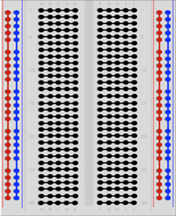
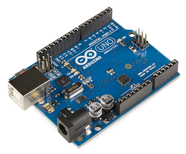
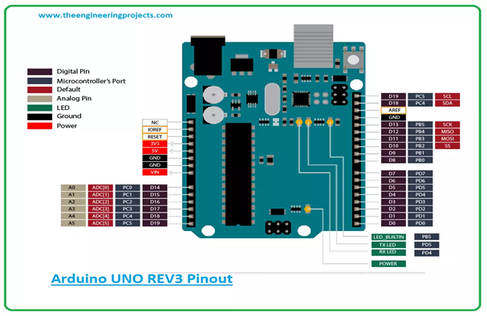
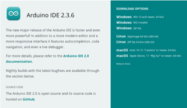
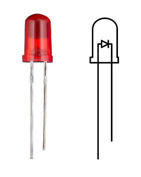
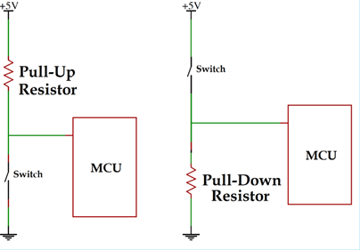

# Activity One: Background Knowledge

## 1 Breadboard 

A breadboard (*Figure 1*) is a prototyping tool used for building and testing circuits without the need for soldering. It consists of rows and columns of conductive strips underneath a plastic surface with holes, allowing you to easily insert components and wires to form electrical connections. A typical breadboard is divided into two main areas: the power rails and the terminal strips. 

The power rails, running along the sides, are used for connecting power (e.g., 3.3V or GND) throughout your circuit. The terminal strips in the center are arranged in rows and connect vertically underneath the board, making it possible to link components without direct wiring. Figure 1 shows a how the connections are made internally on a typical breadboard. 

*Figure 1, Breadboard Connections*

## 2 Wiring Conventions

When wiring circuits or creating schematics, it’s helpful to follow color conventions to make your work easier to read, debug, and share. A common standard is to use red wires for power (Vcc) and black wires for ground (GND).

Beyond that, it’s up to you to define your own consistent system. A good practice is to use one wire color per signal or per section of a circuit, which keeps things organized — especially as circuits grow more complex.

When you’re just starting out, it’s okay to use a variety of colors to help visualize how different parts of the circuit connect and how signals flow. Over time, developing your own consistent wiring style will make building and troubleshooting much easier.

## 3 Digital Signals

Electrical signals fall into two main categories: digital and analog. A digital signal has only two possible states — known as “High” and “Low”. On the Arduino Uno, a High signal is 5 volts, and a Low signal is 0 volts, also called ground (GND).

Digital signals are used throughout electronics for on/off logic, and they form the foundation for digital communication and control. We’ll explore analog signals, which can vary smoothly between voltages, in the next section.

## 4 Arduino Uno Board

The Arduino UNO (*Figure 2*) is a microcontroller board based on the ATmega328P. It has 14 digital input/output pins and 6 analog inputs. It’s an easy-to-use system designed for hobbyists. 

*Figure 2, Arduino Uno*

## Arduino Pinout Map

A pinout map shows the available pins on your Arduino Uno microcontroller and what functions those pins can be used for. Each pin can have multiple uses:

- Digital I/O (Input/Output) allows the Arduino Uno to read and write to components (LEDs, buttons, etc.) via digital signals. Digital output pins can send signals, either HIGH (5V) or LOW (0V), to other components. Digital input pins can read the state of a digital signal, such as whether a button is pressed or not. In this activity you’ll use a digital output to turn an LED on and off, and a digital input to detect whether a button is pressed.
- Analog inputs read continuous voltage from sensors or potentiometers.
- Communication protocols allow the Arduino Uno to communicate with peripheries via I2C, SPI and UART. Additional info on these protocols is available in section 2.

Figure 3 shows the pinout map for the Arduino Uno board you’re using in this activity. You will likely need to refer to this figure throughout the activity. The digital I/O pins are labeled D0 – D15, and the analog inputs are labeled A0 – A5. There are also pins that are dedicated to the communication protocols labeled I2C, SPI and UART.

*Figure 3, Arduino Uno Pinout Map*

## 5 Arduino Integrated Development Environment (IDE)

If you haven’t installed the Arduino’s IDE yet, download it from the [official Arduino website](https://www.arduino.cc/en/software/) (*Figure 4*). Follow the setup instructions that pop up when you open the file. 

*Figure 4, Downloading Arduino's IDE*

Start the application and do the following:

1. Select **Tools** > **Boards** > **Boards Manager**
2. Search for "**arduino uno r4**"
3. Select **Install** and accept all prompts for installation
4. Once the installation is complete, please confirm you see the following "**Tools** > **Boards** > **Arduino UNO R4 Boards** > **Arduino UNO R4 Minima**"

## 6 LED Polarity

Many electronic components, such as resistors, are non-polar. This means that the orientation of the component relative to the flow of electricity does not matter. Other components are polar, where the orientation of the component relative to the flow of electricity does matter. One such component is a diode. Diodes are designed specifically to allow electricity to flow in a certain direction and not in the other. LEDs (light emitting diodes) are diodes that also emit light. Figure 4 shows an LED.

Notice that one leg is longer than the other. The longer leg is the anode and is connected to a positive voltage. The shorter leg is the cathode and is connected to a negative voltage (GND). If the LED is connected in the wrong orientation, then no electricity will flow, and the LED will not light up.

*Figure 5, LED*

## 7 Pull-up and Pull-down Resistors

If a line in a circuit isn’t explicitly set to a voltage it is considered “floating”. In electronics, it is undesirable for any lines to be floating, so we use pull-up and pull-down resistors to passively set the voltage of lines that are not being set otherwise. Figure 6 shows the wiring diagram for pull-up and pull-down resistors. Please note that MCU stands for microcontroller unit, which in our case is the Arduino Uno.

*Figure 6, Pull Up and Pull Down Resistors*

Consider the pull-down resistor diagram. When the switch is open, the voltage on the MCU pin is very close to ground (if the pull-down resistor has a low resistance, which they typically do). When the switch is closed, the voltage on the MCU pin is 5V, and the resistor measures 5V across. This behaviour is mirrored for the pull-up resistor.

---

|Back: [Introduction](README.md) | [Top](README.md) | [Activity 1: Inputs and Outputs](activities/digital_io/tutorial.md) |
|---|---|---|
