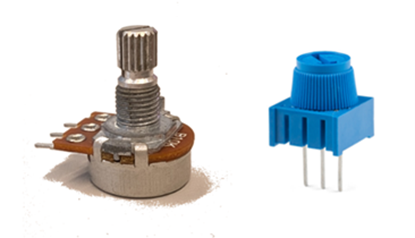
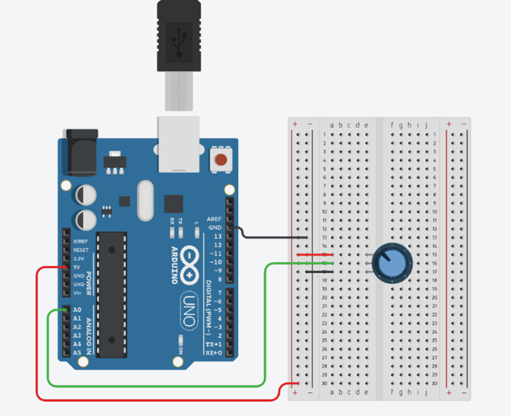

# Activity 2, Analog Inputs and UART

Analog signals are everywhere in the real world, like temperature, light, or sound.
Microcontrollers cannot process these signals directly without an Analog-to-Digital Converter (ADC).
Learning to work with ADCs is crucial because sensors that detect analog signals are key in robotics, automation, and even biomedical applications.
Understanding how to read analog signals and convert them into data that a microcontroller can use opens possibilities for building complex, responsive systems.

## Analog Signals

Digital signals are defined as signals that can take on only 2 different states or voltage levels in background.
Analog signals, in contrast, can take on any voltage between its minimum and maximum.


## Measuring Analog Signals using Microcontrollers – ADCs

Microcontrollers are digital devices, which makes it somewhat complicated to read analog signals.
Specialized devices called ADCs (Analog-to-Digital Converters) are used to convert analog voltages into digital values that microcontrollers can understand.
The Arduino Uno has a built-in 10-bit ADC on each of its analog pins (A0–A5), making this process straightforward.
We would say that the resolution in bits is 10 bits.
This means each analog input is represented by one of 2¹⁰ or 1024 distinct values where 0 represents 0 V and 1023 represents 5 V.

> [!NOTE]
> What would a reading of "120" tell you about the analog voltage?
> The breaking up of a continuous range, like the possible voltages read by an ADC, into a discrete set of steps is called **quantization**.
> If the ADC breaks the range into even intervals and takes the lowest value of each interval for values between the intervals, then the equation would be
>
> $$ \frac{5\pu{V} - 0\pu{V}}{2^{10} - 1} * 120 = 200/341\pu{V} $$
>
> In fact, the UNO R4 provides a [maximum resolution of 14 bits](https://docs.arduino.cc/tutorials/uno-r4-minima/adc-resolution/) for accurate analog readings.


## Potentiometers

A potentiometer acts as a variable voltage divider. The outer pins are connected to a voltage supply and ground, while the middle pin outputs a voltage between these two values, depending on the position of the dial. The output voltage varies linearly with the dial’s angle, ranging from 0 V (ground) to the supplied voltage (5 V in this case).



*Figure 7, Potentiometer*


## UART and Serial Communication

UART (**u**niversal **a**synchronous **r**eceiver-**t**ransmitter) is an important protocol for data exchange between devices. Many embedded systems require communication between the microcontroller and a computer or another microcontroller. Mastering UART is necessary for creating systems that can share data, like sensors sending information to a central processor or logging data to a computer.
The Arduino Uno has two dedicated UART pins:
- D0 - RX (Receive)
- D1 - TX (Transmit)

It also has a built-in USB-to-Serial chip. When you connect your Arduino to your computer via USB and use the **Serial.begin()** and **Serial.println()** functions, you’re communicating through these UART pins. There’s no need to connect anything to the physical pins.

## Task
In this task, you will connect the 5V pin to a potentiometer, read its voltage using an analog input pin, and display the value in the Serial Monitor.

## Wire your Circuit

Refer to Figure 8 for the circuit’s wiring.
1.	Use the breadboard’s power and ground rails to connect the outer pins of the potentiometer 
2.	Connect the power and ground rails to 5V and GND on the Arduino. 
3.	Connect the middle (wiper) pin of the potentiometer to analog pin A0.



*Figure 8, Layout Diagram for Potentiometer*


## Add your Code
Once again, the code is provided for you. There is no special configuration is required - just open the Arduino IDE and paste this code into a new sketch/project:

### Definitions
````cpp
int potPin = A0;
int adcValue = 0;
````

### Setup
````cpp
Serial.begin(9600);
````

### Loop
````cpp
adcValue = analogRead(potPin);
Serial.println(adcValue);
delay(100);
````

This code reads a variable voltage between 0V and 5V using analog input pin A0. 
- **analogRead(potPin)** reads the voltage on analog pin A0 and converts it to a 10-bit digital value (0 -1023)
- **Serial.begin(9600)** starts serial communication so you can view the readings in the Serial Monitor
- **Serial.println(adcValue)** prints the result to your computer


## Challenge
Use a potentiometer to control the frequency of a blinking LED. See the Potentiometers section for how to use the potentiometer. The outer pins are connected to a voltage supply and ground, while the middle pin outputs a voltage between these two values, depending on the position of the dial.  


|Back: [Activity 1: Inputs and Outputs](../digital_io/tutorial.md) | [Top](../../README.md) | [Activity 3: Pulse Width Modulation](../pulse_width_modulation/tutorial.md) |
|---|---|---|
