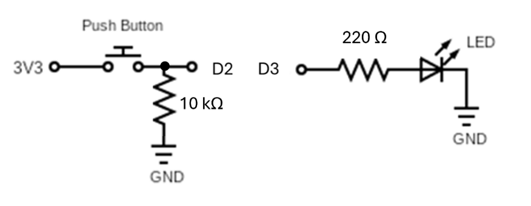
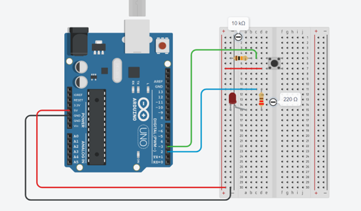
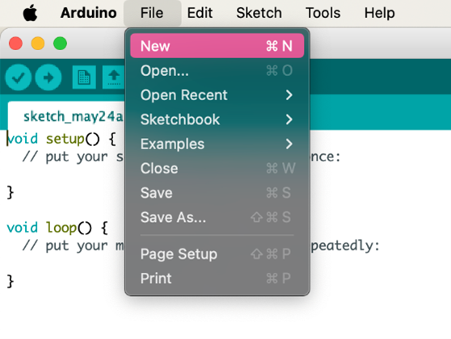
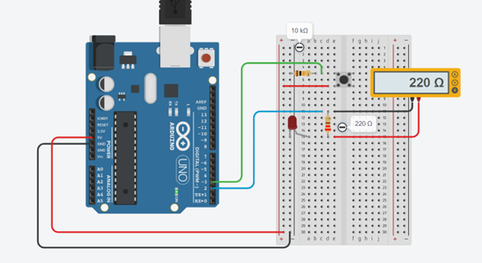
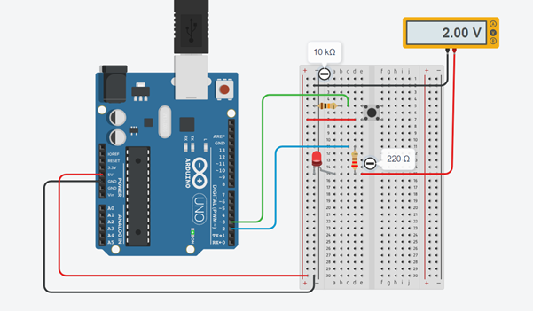
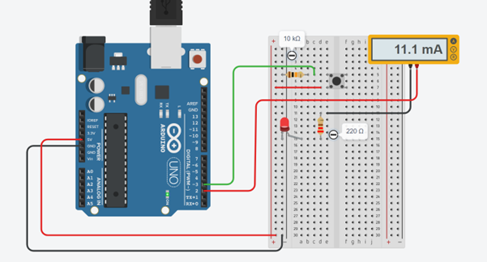

# Activity 1, Digital Inputs and Outputs

In this task you will control an LED with a button. When the button is pressed, the LED will turn on, and when the button is released, the LED will turn off. Figure 7 shows the circuit you’re going to build:



*Figure 7, LED - Pushbutton Circuit*


Here’s how the circuit works:

1.	The button is connected between the 5V power rail and a digital input pin (e.g., pin 2). When the button is pressed, the pin is connected directly to 5V, and the Arduino will read the pin as “High”. 
2.	When the button is not pressed, the pin is tied to ground through the 10kΩ pull-down resistor between the input pin and GND. This ensures the input pin not floating when the button is not pressed.
3.	The LED is connected in series with a current-limiting resistor to prevent it from burning out. The resistor connects to a digital output pin, which can be toggled HIGH or LOW to turn the LED on or off. Note that the LED must be oriented correctly, with the longer leg (anode) connected to the resistor (and then to the digital output), and the shorter leg (cathode) connected to GND. If you flip the LED, it will not light up.


## 1 Build your Circuit

If you’ve never used a breadboard before, please refer to Figure 8 and follow these instructions:

1.	Place the push button on the breadboard straddling the centre divider
    - Connect one of its legs to the breadboard’s power rail with a red wire
    - Connect its other leg to one leg of the 10 kΩ resistor (brown, black, orange). Put the resistor’s other leg in a different row
    - Connect the resistor’s other leg to the breadboard’s ground rail with a black wire
2.	Place the LED on the breadboard
    - Connect the LED’s cathode (shorter leg) to the breadboard’s ground rail (black wire)
    - Connect the LED’s anode (longer leg) to one end of the 220 Ω resistor (red, red, brown). Put the resistor’s other leg in a different row
3.	Connect the circuit to the Arduino Uno
    - connect the other pushbutton lead to digital pin 2 
    - connect the other leg of the 220 Ω resistor to digital pin 3 
    - connect the breadboard’s power rail to the 5V pin on the Arduino with a red wire
    - connect the ground rail to the Arduino’s GND pin with a black wire
4.	Double check your connections 
    - Arduino’s 5V to the power rail
    - Breadboard’s power rail to the pushbutton
    - Pushbutton to 10 kΩ resistor
    - 10 kΩ resistor to digital pin 2
    - Digital pin 3 to the 220 Ω resistor
    - 220 Ω resistor to the LED’s anode (longer leg)
    - LED’s cathode (shorter leg) to the breadboard’s ground rail
    - Ground rail to Arduino’s GND



*Figure 8, Sample Layout  for Pushbutton and LED*

## 2 Create Your Project (Sketch)

Now you’re ready to create the project (aka sketch) and write the code to control your system. Follow these steps:

1. Start the Arduino Integrated Development Environment (IDE)
2. Go to **File** > **New** to create a new sketch (project). This will open a blank window where you can begin coding for the Arduino Uno (see Error! Reference source not found.).
3. Click **File** > **Save As** and name your project (e.g. learningArduino.ino). It’s a good habit to avoid spaces or special characters in the file name.




*Figure 9, Creating a New Project*

## 3 Add your Code

Now it’s time to write your code. We’ve written it for you this time, so please copy and paste this code into the Arduino IDE:

### Definitions
````arduino
const int buttonPin = 3;
const int ledPin = 2;
````

### Setup
````arduino
pinMode(buttonPin, INPUT); 
pinMode(ledPin, OUTPUT);
````

### Loop
````arduino
int state = digitalRead(buttonPin);
if (state == HIGH) {
    digitalWrite(ledPin, HIGH);

} else {
    digitalWrite(ledPin, LOW);

}
````

Here’s an explanation of the code:

1.	const int buttonPin = 3;
    - Declares a constant variable for the button input pin. This means digital pin 2 will be used to detect the state of the pushbutton.
2.	const int ledPin = 2;
    - Declares a constant variable for the LED output pin. This sets digital pin 2 as the one that controls the LED.
3.	pinMode(buttonPin, INPUT);
    - Configures pin 3 as a digital input, allowing it to detect if the button is pressed or not.
4.	pinMode(ledPin, OUTPUT);
    - Configures pin 2 as a digital output, which can be set HIGH (5V) or LOW (0V) to control the LED.
5.	digitalRead(buttonPin);
    - Checks the voltage level of pin 3. If the button is pressed, it reads HIGH; if not pressed, it reads LOW.
    - If the button is pressed, digitalWrite(ledPin, HIGH); turns the LED on.
    - If the button is not pressed, digitalWrite(ledPin, LOW); turns the LED off.

## 5 Test your Circuit
The system is working correctly if:
1.	The LED turns on when the pushbutton is pressed
2.	The LED turns off when the pushbutton is released

You can test this by pressing and holding the button — the LED should remain lit for as long as the button is held down. When you release the button, the LED should turn off immediately. If this behavior does not occur, double-check the wiring of your button, LED, resistor, and the code logic. Ensure that the button pin is properly pulled down using a resistor (typically 10kΩ as discussed in Section 1) to avoid a floating input.


## 6 Aside - Multimeters

A multimeter is a valuable tool for debugging and exploring how electricity flows in a circuit. Whether you’re using a handheld multimeter or a bench/tabletop multimeter, the basic functions are the same. Here’s how to measure resistance, voltage, and current in this project:

### 6a - Measuring Resistance

1.	Power off your Arduino.
2.	Disconnect one leg of the resistor from the breadboard to avoid interference from the circuit.
3.	Set the dial to the Ω (ohm) symbol.
4.	Touch one probe to each side of the resistor (see Figure 10)
5.	You should see a reading close to 220Ω.

**Tip:** Handheld multimeters may require manual range setting, while tabletop multimeters often auto-range and may give more precise decimal values.



*Figure 10, Measuring Resistance*

### 6b - Measuring Voltage

1.	Keep the circuit powered by uploading the Arduino code and pressing the button.
2.	Set the dial to DC Voltage (V⎓).
3.	Place the black (COM) probe on GND.
4.	Place the red probe on the LED’s anode (the longer leg).
5.	When the button is pressed, you’ll see:
    - ~2V across the LED (its voltage drop)




*Figure 11, Measuring Voltage*


### 6c - Measuring Current
**Important:** You must connect the multimeter in series, not parallel!

1.	Turn off power.
2.	Locate the wire that connects digital pin 2 to the 220-ohm resistor.
    - Remove that wire from pin 2 (leave it connected to the resistor)
3.	Set the dial to DC current (mA or A).
4.	Move the red probe to the “A” or “mA” port (check your meter).
5.	Connect the red probe to digital pin 2, and the black to the resistor leg (or the now free end of the wire going to the resistor).
6.	Power on and press the button - you should read about 10 - 15 mA.



*Figure 12, Measuring Current*

Multimeters are essential tools for electronics — the earlier you get comfortable using one, the more confident you’ll be in building and troubleshooting your circuits!


## Challenge

Create a system that uses two pushbuttons:
1.	Button 1 turns the LED on
2.	Button 2 turns the LED off
The LED should stay on after the "On" button is released and only turn off when the "Off" button is pressed. Likewise, the LED should stay off after the "Off" button is released, until the "On" button is pressed again.

This behavior is known as a latching system -  the LED "remembers" its state. 

|Back: [Background](../../00_background.md) | [Top](../../README.md) | [Activity 2: Analog Inputs and UART](activities/digital_io/tutorial.md) |
|---|---|---|
