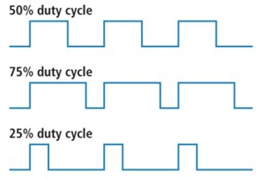
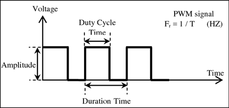
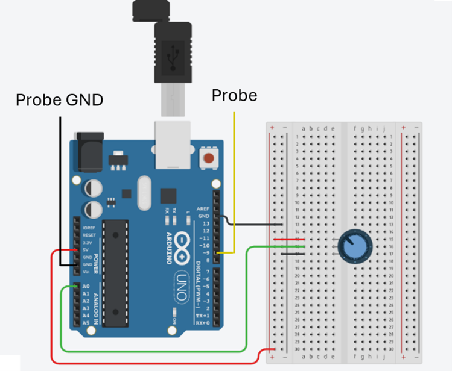
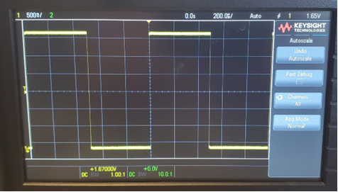

# Activity 3, Pulse Width Modulation and Oscilloscopes

Pulse width modulation (PWM) is a versatile technique used for controlling devices like motors and LEDs with variable brightness. It’s widely used in power control applications, signal modulation, and communication systems. Learning how to generate PWM signals and analyze them with an oscilloscope will help you develop a clear understanding of how to create efficient control systems in real-world applications. These skills apply directly to automotive systems, robotics, and any system that requires precision control.


## 3.1 PWM 
PWM is a technique that is used to approximate analog signals using digital signals. Figure 15 demonstrates the concept of duty cycle, which is the percentage of time that the signal is in the “High” state for. Figure 15highlights a duty cycle’s amplitude, period and frequency. Amplitude is the voltage of the “High” state, or the maximum voltage that the signal reaches. The period is the time for one full cycle to occur (time from rising edge to rising edge). The frequency is 1 divided by the period.  



*Figure 15, PWM Duty Cycles*



*Figure 16, PWM Frequency and Amplitude*

The recommended PWM pins for the Arduino Uno are digital pins 3, 5, 6, 9, 10, and 11. You can identify these pins on the Pinout map because they’re marked with a tilde (~).

## 3.2 Oscilloscopes

Oscilloscopes are electronic devices that are used to view the voltage of a signal over time. Cursors can be used to measure the time and voltage of signals. They are very useful for hardware debugging since they give a visual of signals which can be compared with expected results. 

## 3.3. Task
In this task, you will generate a PWM signal on the Arduino board and view the square waves on an oscilloscope. Your potentiometer will control the percentage of time the duty cycle is high. 

## 3.4 Wire your Circuit
There’s not much to change in your circuit. You’ll connect the oscilloscope probes to the Arduino as shown in Figure 17. (Yellow to D9, Black to GND).



*Figure 17, PWM Connections*

## 3.5 Add your Code 
Once again, the code is provided for you. There is no special configuration is required - just open the Arduino IDE and paste this code into a new sketch/project:

### Definitions
````cpp
int ledPin = 9;      // LED connected to digital pin 9
int analogPin = A0;  // potentiometer connected to analog pin A0
int val = 0;         // variable to store the read value
````

### Setup
````cpp
pinMode(ledPin, OUTPUT);  // sets the pin as output
````

### Loop
````cpp
val = analogRead(analogPin);  // read the input pin
analogWrite(ledPin, val / 4); 
// analogRead values go from 0 to 1023, analogWrite values from 0 to 255
````

This code reads voltage between 0V and 5V from the potentiometer and outputs a PWM signal that you’ll view on the oscilloscope. 
- **analogRead()** reads the voltage on the specified analog pin and converts it to a 10-bit digital value (0 -1023)
- **analogWrite ()** divides the digital equivalent of the analog value by 4, outputting an 8-bit value (0 – 255) to the specified digital PWM output pin


## 3.6 The PWM Signal 
Once your code is running, click the “Auto” button on the oscilloscope. This will automatically configure the voltage and timing scale to view the signal clearly. If this does not work, try setting the voltage scale to 1V/div and the timing scale to 100 microseconds. The PWM signal should be a square wave like what’s shown in Figure 18. Note that the duty cycle is 50%, the period is 1 ms, and the frequency is 1000 Hz. 



*Figure 18, PWM Results*

## Challenge

Add two LEDs to your circuit. One can be connected to D9 where you observed the waveforms, and the other to one of the Arduino’s other PWM output pins (see section 3.1). Don’t forget the current-limiting resistors.

Your challenge is to vary the intensity of the two LEDs such that one is driven at the level specified by the potentiometer (as the code does right now) and the other by its complement. For example, if calculated value controlling the first LED is 150, then the other is (255-150) or 115. If the calculated value is 25, then the value for the 2nd LED is 255-25 or 230. 

Modify the code from section 3.5 to create this very simple light show. As you vary the PWM signal, the two LEDs fade or brighten accordingly.

## 4 Related Resources 
The following resources may be useful as you start to use an Arduino for other projects: 
- [Resistor Color Code Calculator](https://www.calculator.net/resistor-calculator.html)
- [Hints about Wiring for Your Electronics Projects](https://www.dummies.com/article/technology/electronics/general-electronics/stock-up-on-wire-for-your-electronics-projects-180328/) 


|Back: [Activity 2: Analog Inputs and UART](../analog_and_uart/tutorial.md) | [Top](../../README.md)
|---|---|