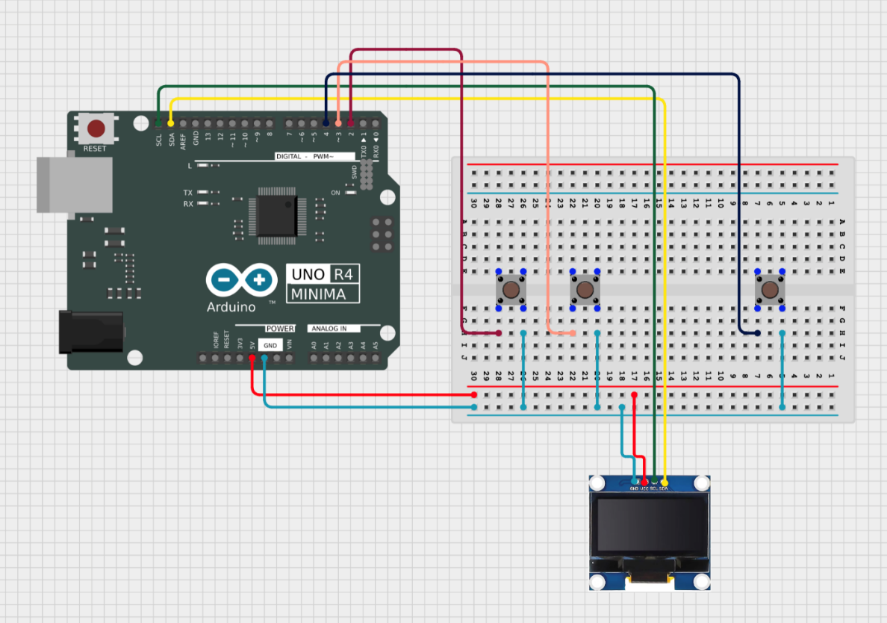

# Building the Pong Circuit

Pong is a simple game, however the logic used is fundamental to creating interactable devices that respond to the real world. This activity aims to help you grasp the principles of digital logic and interactable devices by introducing concepts such as button polling, timers and interrupts. These principles are the core of the systems we interact with every day ranging from handheld devices to complex game engines.

Follow Figure 1 below to connect the OLED display and the 3 pushbuttons to the Arduino. Ensure the positive rail on the breadboard that is connected to the OLED display is connected to the 5V pin on the Arduino, not the 3.3V. The pushbutton that will be the game pause button must remain connected to the Digital0, Digital1, Digital2, or Digital3 pins on the Arduino Uno as the pause function will be implemented using an interrupt. These pins are the only digital pins that can be used for external interrupts on the Arduino. 

 If your kit included a shield, attach the shield onto the Arduino and wire the buttons as shown. Otherwise, if your kit included an individual screen, wire the buttons and the screen as shown. 
 
 

---

|Back: [Introduction](README.md) | [Top](README.md) |Next: [Code checklist](01_checklist.md)|
|---|---|---|
