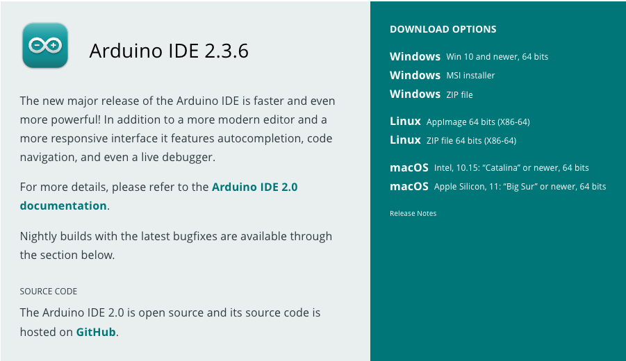

# Setting up the Arduino Development Environment

If you're here, you want to get the necessary tools on your computer to interact with the Arduino Uno R4 board for the [introductory](../arduino_beginner/README.md) and [intermediate](../arduino_intermediate/README.md) workshops.


## Installing the Arduino Integrated Development Environment

The Arduino IDE only supports 64-bit operating systems.

Go to [the Arduino IDE Release for 2.3.7 on GitHub](https://github.com/arduino/arduino-ide/releases/tag/2.3.7), download the right version for your operating system, and install.
Platform specific instructions follow.


### Windows

1. Download the [`arduino-ide_2.3.7_Windows_64bit.msi`](https://github.com/arduino/arduino-ide/releases/download/2.3.7/arduino-ide_2.3.7_Windows_64bit.msi) installer.
2. Double-click the installer.
3. Follow all installation prompts on the screen.




### Linux

The Arduino IDE is packaged in both the AppImage and generic Linux executable formats.
We will use the generic Linux format in these instructions.

1. Download the [`arduino-ide_2.3.7_Linux_64bit.zip`](https://github.com/arduino/arduino-ide/releases/download/2.3.7/arduino-ide_2.3.7_Linux_64bit.zip) program.
2. Unzip the program into any folder.
3. The program is now installed.
   Start it by running the `arduino-ide` executable.
4. Follow these [Arduino Support instructions](https://support.arduino.cc/hc/en-us/articles/9005041052444-Fix-udev-rules-on-Linux#renesas) to add the necessary `udev` rules to connect to the UNO R4 Minima board.


### macOS
TBD


## Configuring the IDE for our specific board (UNO R4)

1. On the top menu bar select **Tools > Boards > Boards Manager**.
2. In the prompt that pops up, search for the "arduino uno r4".
3. Select the only result and "Install".
4. Accept all prompts during the installation process.

After installation completes, please confirm that you can see a new menu item in the top menu bar: **Tools > Boards > Arduino UNO R4 Boards > Arduino UNO R4 Minima**.
You have now configured the IDE correctly.


## Linux note: Arduino board found but cannot upload

If your IDE detects the Arduino board but cannot upload to it, the most common reason is that your Linux user account does not have permission to access the serial port.
Use these steps to troubleshoot this:

1. **Find the serial port the board is connected to.**
   Change directories into the folder where you unzipped the Arduino IDE zip file.
   Then, access the `arduino-cli` executable and run `arduino-cli board list`.
   
``` shell
# From zip file root
cd resources/app/lib/backend/resources
./arduino-cli board list

# Example output
# Port         Protocol Type              Board Name            FQBN                       Core
# /dev/ttyACM0 serial   Serial Port (USB) Arduino UNO R4 Minima arduino:renesas_uno:minima arduino:renesas_uno
```

2. **Check permissions on that serial port.**
   Run `ls -ld /dev/ttyACM0 | awk '{print $3 " " $4}'` (change to your device).
   The output is the owner and group that owns the serial port device.
   Usually the owner is the `root` user and the group required is the `dialout` group.

3. **Check if you are in the group needed.**
   Run `getent group dialout` (change to your group).
   If your username is not printed, continue to add yourself to the group.

4. **Add yourself to the group.**
   Run `usermod -aG username dialout`.
   
5. **Log out and back in.**
   This updates permissions on your device.

You should now be able to upload sketches from the Arduino IDE to your board.
