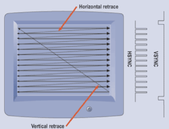
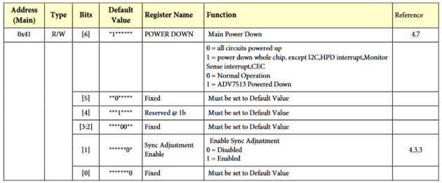
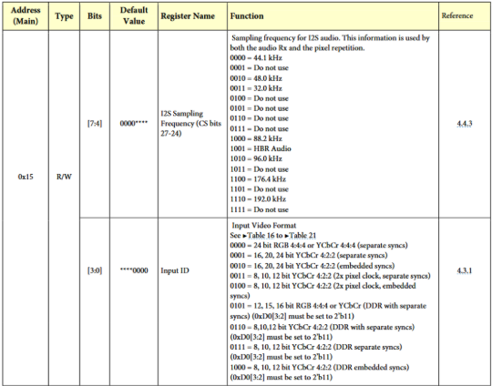
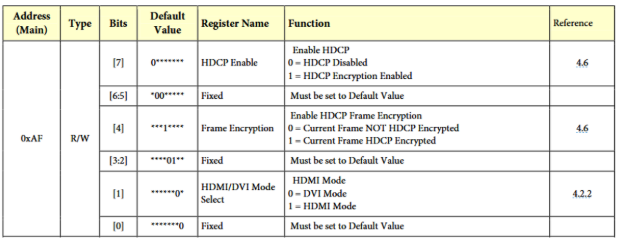

# Appendix B – Video and the ADV7513 Encoder

## Horizontal and Vertical Sync

In this workshop, we used horizonal sync (h-sync), vertical sync (v-sync), and data enable (DE) signals to control the video timing of our HDMI display. These signals are used by the display to recognize the ends of rows of pixels, and the ends of a complete frame of pixels.

H-sync and v-sync are part of a lineage of compatibility originating from CRT displays. In CRT displays, images are displayed by shooting a thin beam of electrons, known as the scanline, at phosphorescent materials on the face of the display. The scanline moves across the face of the display many times per second, from left to right, top to bottom, leaving a trail of dimly glowing material whose brightness corresponds to the intensity of the electron beam. By varying the intensity of the electron beam as we move it, we can draw an image onto the screen. We perceive the quickly moving beam as a cohesive image because of a phenomenon known as [persistence of vision](https://en.wikipedia.org/wiki/Persistence_of_vision).


*Figure 9 - Image of scanline moving across a CRT with 12μs exposure, courtesy of [The Slow Mo Guys](https://www.youtube.com/watch?v=V6XnSvB34y8)*

To draw an image to the display, we need to provide a signal corresponding to the desired brightness of the image at the current position. To synchronize the position of the scanline on the display with the brightness data being sent, we send two additional signals to the display: an h-sync and a v-sync signal. The h-sync signal tells the display to move the scanline back to the left and down a line. The v-sync signal tells the display to move the scanline back to the top-left of the screen. The motion of the scanline with respect to the h-sync and v-sync signals is shown in Figure 10.



*Figure 10 - Scanline Path*

To prevent artifacts from the beam changing directions while lit, additional space before and after the visible areas are added, which gives the beam time to turn off before the move and on after the move. These spaces are known as the front porch (the area before the visible zone where the beam turns on) and the back porch (the area after the visible zone where the beam turns off). H- and v-syncs occur in the time between front and back porches. To avoid sending brightness data while the beam is in the non-visible areas, we use one more signal, data enable (DE). DE tells us when we're outside the visual area, and it's used to shutter the beam.

Modern displays use different methods to display pixels, but the ADV7513 still supports h-sync and v-sync signals to synchronize video data transmission.

## Resolutions and Supported Timings

In the workshop, we used a pixel clock of 74.25MHz. This clock speed was chosen to match the desired framerate with the horizontal and vertical resolution we are displaying, the h-sync and v-sync durations, and the front and back porch durations. In this workshop, we have a visible display area of 1280x720 pixels. However, each row also includes 110 pixels worth of front porch, 220 pixels worth of back porch, and 40 pixels worth of h-sync (e.g., the front porch lasts the same duration it would take to scan 220 pixels, etc.). Additionally, each frame has 5 rows worth of front porch, 20 rows worth of back porch, and 5 rows worth of v-sync. All told, this gives us an equivalent horizontal resolution of 1280+110+220+40=1650 pixels. Similarly, it gives us a vertical resolution of 720+5+20+5=750 rows. So, for each frame, we need to send 1650⋅750=1237500 pixel clock pulses. Since we display our game at 60 frames per second, our clock must run at a rate of 1237500 cycles/frame ⋅ 60 frames/second = 74250000 Hz = 74.25 MHz.

You may try changing the resolution of the game, but many monitors only support certain [standard resolutions, framerates, and timings](https://en.wikipedia.org/wiki/Display_resolution_standards). This [tool](https://tomverbeure.github.io/video_timings_calculator) will help you select timing parameters and let you know which protocols support your chosen resolution, framerate, and timing parameters.

## Encoder Configuration

The ADV7513 HDMI encoder supports a variety of interesting features, including hot-plug detection, I2S audio, and 3D video. For the purposes of this workshop, the chip was configured to use 24-bit RGB (4 bits each for red, green, and blue channels) with separate video synchronization signals, no I2S audio, no [High-bandwidth Digital Content Protection](https://en.wikipedia.org/wiki/High-bandwidth_Digital_Content_Protection) (HDCP, a protocol to prevent unauthorized copying of material by interception along the HDMI cable), and HDMI mode.

```vhdl
-- init table; data to send to hdmi transmitter on startup
constant REG_CT: NATURAL := 3;
type REG_ARR is array (REG_CT-1 downto 0) of
STD_LOGIC_VECTOR(7 downto 0);

signal reg_addr: REG_ARR := (
x"41", x"15", x"AF"
);
signal reg_data: REG_ARR := (
x"10", x"10", x"06"
);
```

The above code sets up the sequence of I2C writes to send to the ADV7513 encoder. In the first message, we write 0x10 (0b00010000) to address 0x41. This powers on the chip. A register description for this address is shown in Figure 11.



*Figure 11 - Register Description of 0x41 for ADV7513*

The second message writes 0x10 (0b00010000) to address 0x15. This sets the video mode to 24-bit RGB with separate synchronization and disables the I2S audio. A register description for this address is shown in Figure 12. Unfortunately, the development board we use in this workshop does not include the physical connections to the ADV7513 to use HDMI audio. It does however have a separate audio system that uses the three 3.5mm jacks on the side of the board.



*Figure 12 - Register description of 0x15 of ADV7513*

The final message writes 0x06 (0b00000110) to address 0xAF. This disables HDCP, and configures the chip to use HDMI mode (rather than DVI mode, which pares down functionality for the sake of compatibility). A register description for this address is shown in Figure 13.



*Figure 13 - Register description of 0xAF of ADV7513*

More information on the ADV7513 can be found in its [datasheet](https://www.analog.com/media/en/technical-documentation/data-sheets/ADV7513.pdf), its [programming guide](https://www.analog.com/media/en/technical-documentation/user-guides/ADV7513_Programming_Guide.pdf), and its [hardware guide](https://www.analog.com/media/en/technical-documentation/user-guides/ADV7513_Hardware_Users_Guide.pdf) (archived [here](https://web.archive.org/web/*/https://www.analog.com/media/en/technical-documentation/data-sheets/ADV7513.pdf), [here](https://web.archive.org/web/*/https://www.analog.com/media/en/technical-documentation/user-guides/ADV7513_Programming_Guide.pdf), and [here](https://web.archive.org/web/*/https://www.analog.com/media/en/technical-documentation/user-guides/ADV7513_Hardware_Users_Guide.pdf), respectively). Notably, the programming guide includes a list of registers accessible over I2C and provides more information on configuring the encoder.

---

|Back: [Appendix A](appendix_a.md) | [Top](README.md) |Next: [Appendix C](appendix_c.md)|
|---|---|---|