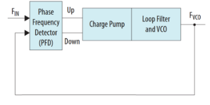

# Appendix C – Phase-Locked Loops

Phase-Locked Loops (PLLs) are devices capable of generating new clock frequencies from a reference clock. The new frequencies are tightly coupled to the original clock, and maintain a constant phase relationship (i.e., one does not drift with respect to the other).

## Simple PLL

The simplest form of a PLL is one that generates a clock of the same frequency as the input clock. The most common implementation consists of a couple building blocks:

- Phase/frequency detector
- Charge pump
- Low-pass filter
- Voltage-controlled oscillator

The phase detector compares the output and input clock, determining whether the output clock is running slow or fast. The output of the phase detector is fed into a charge pump which tracks the frequency difference between the two clocks (think an integrator). The output of the charge pump is fed through a low-pass filter (to prevent random jitter from causing rapid overcorrections). Then, the filtered output is fed to a voltage-controlled oscillator, which generates the output clock. This circuit is illustrated in Figure 14.

*Figure 14 - Simple PLL*

As the output clock drifts relative to the input clock, the phase detector sees the offset between the two clocks. It adjusts the charge pump in accordance, which influences the frequency of the VCO until the clocks are in-phase.

## PLL with Frequency Dividers

To generate clocks with frequencies other than the input frequency, we can use clock dividers to adjust the input and feedback frequencies. Consider the same circuit as above but with a clock divider before the phase detector, as shown in Figure 15.

*Figure 15 - PLL with input divider*

In this configuration, F_VCO = F_REF = F_IN/N. From this, we can get new clock frequencies that are integer divisors of F_IN. This is still too limiting – what if we want an output frequency that is two thirds the input frequency, or that is double the input frequency? To make our PLL more flexible, we incorporate a second frequency divider in the feedback path of our PLL. This circuit is shown in Figure 16.

*Figure 16 - PLL with input and feedback dividers*

Here, F_FB = F_REF = F_IN/N, and F_FB = F_VCO/M. Thus, F_VCO = (M/N)F_IN. Now, we can generate any frequency that is a rational multiple of the input frequency. This arrangement is called a frequency synthesizer, as it can generate an arbitrary frequency from a reference frequency within any specified accuracy. It's often used to generate a variety of clock frequencies with no drift relative to a single central clock (as we did in our workshop).

In a real-world design, we are limited by the range of our divisors, i.e., the maximum and minimum values of M and N. This is why when we generated our PLL IP in this workshop, we could not generate an exactly 74.25MHz signal. The problem of approximating a real number with rational numbers is known as [Diophantine approximation](https://en.wikipedia.org/wiki/Diophantine_approximation).

To learn more about PLLs and their implementation, see the documentation for the PLL component we used in today's workshop [here](https://www.intel.com/content/www/us/en/docs/programmable/683432/current/phase-locked-loop-pll-reconfiguration-guide.html) (also archived [here](https://web.archive.org/web/*/https://www.intel.com/content/www/us/en/docs/programmable/683432/current/phase-locked-loop-pll-reconfiguration-guide.html)). Additionally, the [Wikipedia page](https://en.wikipedia.org/wiki/Phase-locked_loop) for PLLs is a valuable resource.

---

|Back: [Appendix B](appendix_b.md) | [Top](README.md) |Next: [Appendix D](appendix_d.md)|
|---|---|---|