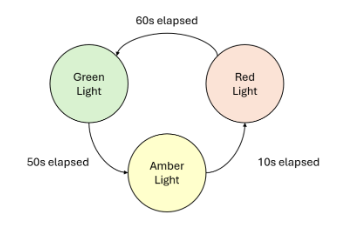
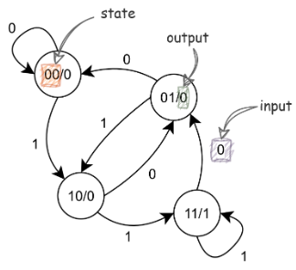
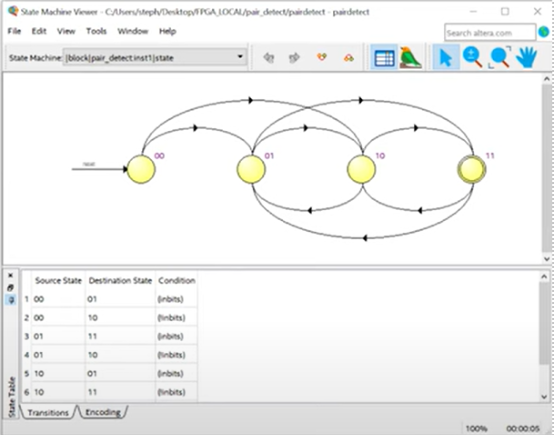
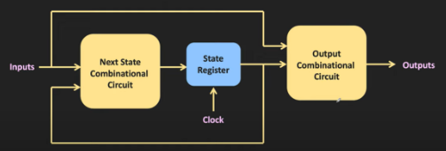
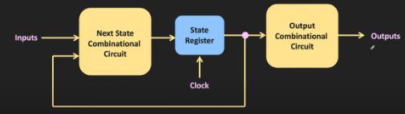

# Appendix D – State Machines

A finite state machine (FSM) is a machine that can only ever be in one of a finite number of states at any given time. The state of the machine can only be changed in response to some input, and this change is referred to as a transition. The different states and transitions are what are used to encapsulate a set of behaviors.

One example of a simple FSM is a traffic light. If the light has been green for long enough, it will transition to amber to indicate a stop will start soon. However, the green light must never transition from green immediately to red, since this would be a safety issue. Thus, the FSM for the traffic light does not include a transition from green directly to red. An illustration of a simple traffic light FSM is shown in Figure 17.



*Figure 17 - State machine for traffic light*

**Fun Fact:** State machines are extensively used in game development. For example, if you're playing Super Mario and you hit the A button on the controller, Mario's state transitions from standing to jumping. You may have also noticed that in a few games you can't do a combination of actions like jumping and swinging a sword simultaneously. This might be because these actions are independent states, and there is no such transition between them, and thus there is no way for the character to jump and swing their sword. For more info on how state machines are used in game development, see [this video](https://www.youtube.com/watch?v=ow_Lum-Agbs).

## Defining a Finite State Machine

A finite state machine can be completely defined by:

- The set of all states in the state machine
- The set of all transitions between the states (i.e., which states a given state can transition to, and why)
- The initial state of the machine

## Pair Detector Example

A pair detector is a device used to identify pairs of 1s from a stream of incoming bits (i.e., we only have access to the next incoming bit in an ongoing sequence of bits). For example, in the stream of bits 110101000110 (arriving in order from left to right), there should only be two pairs identified: **11**0101000**11**0.

To implement an FSM capable of detecting pairs, we'll first consider what possible states the machine should have. Since we're only detecting pairs of bits, our state machine only needs to encode the two latest bits we received as states. So, we'll create four states: 00, 01, 10, and 11. Then, we'll create transitions between the states based on what the most recently received bit is (e.g., if we're in state 01 and receive a 1, we'll transition to state 10). Then, we need to determine behavior for each of our states. A pair will only have been received if we're in state 11 (i.e., 2 consecutive 1's), so we'll make state 11 output 1 to indicate a pair, and the other three states output 0 to indicate no pair. We'll choose our initial state to be 00.

Drawing this state machine, we get the following:



*Figure 18 - State diagram for pair detector*

The diagram shown in Figure 18 can be interpreted by starting in state 00. For each bit received, follow the arrow with the received value to the next state. For example, in the number 110101001010, we'd start in state 00. When we receive the next 1, we transition to state 10. Then, the next 1 is received, changing the state to 11 (which outputs 1, a pair is detected!). This process continues as long as bits are received.

A pair detector could be implemented in VHDL as follows:

```vhdl
signal state: BOOLEAN_VECTOR(1 downto 0);

process(clk) is
begin
case state is
when "00" =>
pair <= '0'
when "01" =>
pair <= '0'
when "10" =>
pair <= '0'
when "11" =>
pair <= '1'
end case;

-- instead of writing each transition out,
-- we'll write them as a rule since they
-- all follow a consistent pattern
state(0) <= state(1);
state(1) <= in_bit;

end process;
```

`state` is the signal that stores our current state. Since our state has a clear bit-wise representation, we'll use a BOOLEAN_VECTOR of size 2. Notice we're not using a STD_LOGIC_VECTOR, since this would include states like "ZZ".

The case statement determines the behavior of the FSM based on the current state. In this example, the behaviors for each state are very simple, outputting '0' for no pair, or '1' for a pair. In a more complex state machine where transitions do not follow a general rule, we would also put state transitions in the case statement.

However, because all our transitions use a general rule of thumb, we embed them with two simple assignment operators, pushing our latest received value onto the state.

Similar to the RTL logic viewer in Quartus, there is also a tool to see state machines in your project. To open this tool, select Tools >> Netlist Viewers >> State Machine Viewer.



## Mealy and Moore State Machines

Two different approaches can be taken to generate outputs from a state machine. These two approaches are classified as Mealy state machines and Moore state machines.

### Mealy State Machine

In a Mealy state machine, the output is a function of the present inputs and the present state as shown in Figure 19.



*Figure 19 - Mealy Machine overview*

### Moore State Machine

In a Moore state machine, the outputs only depend on the current state, as show in Figure 20. Note, this does not mean the inputs have no impact on the outputs, just that the inputs can only modify the outputs by changing the state.



*Figure 20 - Moore Machine Overview*

To learn more about the differences between these two machines, see [this video](https://www.youtube.com/watch?v=8Q2yIbIVGhI).

---

|Back: [Appendix C](appendix_c.md) | [Top](README.md) |
|---|---|