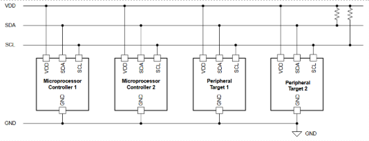
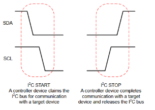
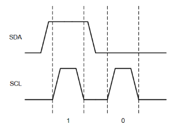
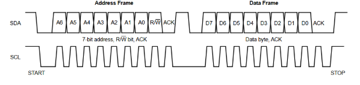

# Appendix A – I2C Protocol

I2C (Inter-Integrated Circuit, I2C) is a serial communication protocol. Its main use is communication between integrated circuits over low speeds and short distances. It allows communication between multiple controllers and multiple targets using just two wires.

I2C communication is performed over two wires, SDA (the serial data line), and SCL (the serial clock line). Both lines are driven by [open collector drivers](https://en.wikipedia.org/wiki/Open_collector) to destructive bus conflicts. A typical wiring diagram for I2C is illustrated in Figure 4.

*Figure 4 - Typical I2C Wiring*

## Packet-Level Synchronization

In I2C, the controller devices are responsible for driving the SCL line. To claim the bus and mark the beginning of a transmission, a controller will drive SDA low, then drive SCL low. To mark the end of a transmission, a controller will release SCL back to high, then release SDA back to high. This is how data is synchronized at the packet level. These start- and end-of-transmission signals are illustrated in Figure 5.

*Figure 5 - I2C Packet-Level Synchronization*

## Bit-Level Synchronization

To transmit values, SDA is released to VDD (a logical '1') or driven to ground (a logical '0'). These changes are clocked by SCL, so they are driven to the line while SCL is low and read when SCL is high. This is how data is synchronized at the bit level. See an illustration of this process in Figure 6. Note that the I2C start and stop signals both involve changing the value of SDA while SCL is high. This allows devices to differentiate the start and stop signals from logical ones and zeros, since nowhere else in a transmission does SDA change while SCL is high.

*Figure 6 - I2C Bit-Level Synchronization*

## I2C Transmission Structure

A complete I2C transmission consists of a start signal, an address frame, one or more data frames, and a stop signal. Address frames and data frames are identical in structure, but an address frame is interpreted by target devices to determine whether the transmission specifically targets them.

I2C frames are each made up of 9 bits, 8 for data/addresses and one for acknowledgement from the target device. The sender of the frame (the controller for address frames and writes, the target for reads) will transmit the 8 data bits in sequence. Then, the receiver drives SDA low at the clock cycle to acknowledge it received the frame. An entire I2C transmission is illustrated in Figure 7.

*Figure 7 - I2C Transmission*

The data bits of an address frame include a 7-bit I2C address, unique to each target on the network, and 1 bit to specify whether the transmission is a read or write ('1' for read, '0' for write). The number of data frames and their contents is up to the target device's specifications.

For a more in-depth explanation of the I2C protocol, see [this document](https://www.ti.com/lit/an/slva704/slva704.pdf) from Texas Instruments (also archived [here](https://web.archive.org/web/20230101000000*/https://www.ti.com/lit/an/slva704/slva704.pdf)).

## FPGA Implementation

To properly power on and configure the ADV7513 encoder, we need to send three separate write commands. The ADV7513 specifies two data frames for write commands: the first is the internal address of the register to write, and the second is the data to write.

The I2C protocol is implemented by a simple state machine. Using a clock divider, the 74.25MHz clock is scaled to a 200kHz clock. Then, the state machine iterates with each pulse of the 200kHz clock. The general idea of the state machine is to iterate over the three commands to send over I2C. For each of those commands, it iterates over the frames to send, and the bits within those frames. A diagram of the state machine is illustrated in Figure 8.

*Figure 8 - I2C State Machine*

Note, the I2C configurator does not check for an acknowledgement signal from the ADV7513. This was deemed acceptable, since, in testing, the ADV7513 never failed to acknowledge a frame. Additionally, failure to transmit a configuration frame is not critical as the program can be manually reset and the configuration retransmitted if the setup fails.

One additional implementation detail of the I2C configurator module is the use of an open-collector driver. Because FPGAs are programmable hardware gates, it's possible to use more than just '1's and '0's for logic – in fact, that's the purpose of the STD_LOGIC type! STD_LOGIC supports a variety of signal types beyond just '0' and '1' and attempts to extend boolean algebra for those values. In our component, we use the high-impedance value, 'Z', to dictate a non-driven open collector driver output. SCL uses a push/pull driver since the FPGA is the only I2C controller on the bus.

---

[Top](README.md) |Next: [Appendix B](appendix_b.md)|
|---|---|