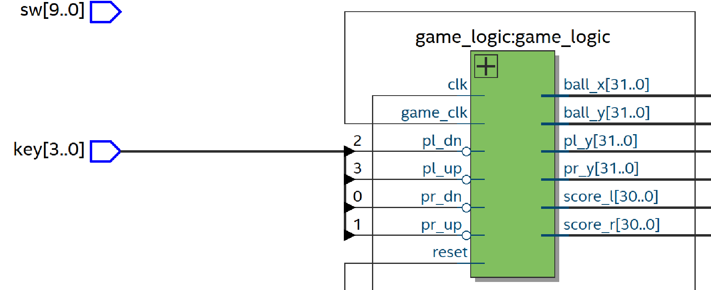

# Drawing Game Objects

In this step, we will use the module we wrote: `rect_display` to draw the ball and paddles for our game of Pong.

## How to Draw Game Objects

### 1. Remove the Test Rectangle from `renderer.vhd`

Open `renderer.vhd`.

Remove `test_rect`, the signal `on_rect`, and their related logic in `renderer.vhd` because it was just a way to test if we're able to draw rectangles on our screen. 

### 2. Instantiate `game_logic` in `hdmi_top.vhd`

Open `hdmi_top.vhd`.

Instantiate the `game_logic` and map the proper ports, creating appropriate signals. 

As you map the ports, here are some things to keep in mind: 
- `clk`: the PLL 74MHz clock signal 
- `game_clk`: our `frame_start` signal from the `video_timing` component 
- `reset`: `(not pll_locked) or reset` (we don’t want to run game logic until the PLL is back after a reset) 
- `pl_up`, `pl_dn`, `pr_up`, `pr_dn` should map to `not key(3)`, `not key(2)`, `not key(1)`, `not key(0)`, respectively 

Here is a block diagram for `game_logic` you may find useful: 




### 3. Wire `game_logic` Signals into `renderer` in `hdmi_top.vhd`

Still in `hdmi_top.vhd`, we need to add all the game logic signals that we left out in previous steps to the `renderer` component in `hdmi_top.vhd`. 

Your `renderer` instatiation statement should look like this now:  

````vhdl
-- renderer instatatioin
renderer: entity work.renderer
	port map(
		hcount => hcount, 
		vcount => vcount, 
		rgb => rgb,
		de => de, 
		pl_y => pl_y, 
		pr_y => pr_y, 
		ball_x => ball_x, 
		ball_y => ball_y, 
		score_l => score_l,
		score_r => score_r
	); 	
````

### 4. Uncomment lines in the `renderer.vhd`

Open `renderer.vhd`.

You need to uncomment all the lines of code which include: 
- The lines in the port declaration  (i.e. `pl_y`, `pr_y`, `ball_x`, `ball_y`, `score_l`, and `score_r`)
- The component instantiations (to draw the paddles and scores)

### 5. Add logic to draw the paddles and ball 

Still in `renderer.vhd`, go to down to its **process**.  Write logic to draw the paddles and ball.

You need to use `on_pl`, `on_pr`, and `on_ball`. You should follow the same approach you used in previously to draw the test rectangle.

### 6. Compile and Verify 

Compile and upload your code. This may take a while. If you followed the steps successfully then you should be displaying the shapes for our pong game.
---
|Back: [Overview: Pong Game Play](08_gameplay_overview.md)| [Top](../README.md) |Next: [Implement Paddle Movement](10_paddle_movement.md)|
|---|---|---|