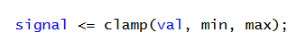

# Implement Paddle Movement

In this step, you will write the logic to drive the movement of paddles in `game_logic.vhd`.

## How to add Paddle Movement in `game_logic.vhd`

### 1. Identify Where to Add Code  

Open `game_logic.vhd`. 

Within the `game_logic` architecture, most of the code has been pre-written for you but one thing we need to add is paddle movement.

Navigate down to this section of the architecture: 


### 2. Write paddle movement logic

Write logic to move the paddles up and down when their respective buttons are pressed. Include checks to prevent them from moving out of the screen bounds. 

This can be copied into the corresponding section of the skeleton code to help you implement paddle movement:

````vhdl
-- FILL IN paddle movement logic here
-- left paddle movement
if (pl_up = '1') then
    -- FILL IN logic to move the paddle upward
elsif (pl_dn = '1') then
    -- FILL IN logic to move the paddle downward
end if;

-- right paddle movement
-- FILL IN logic similar to the left paddle

-- clamp paddle positions to prevent them from extending beyond the screen
````
#### Helpful note

You can use the clamp function in the architecture to bound a number between two values, like so: 



----
Compile and upload your code. This may take a while (around 10-12 mins). If you're successful, you will have a fully functional game of Pong!

---
Back: [Drawing Game Objects](09_draw_objects.md)