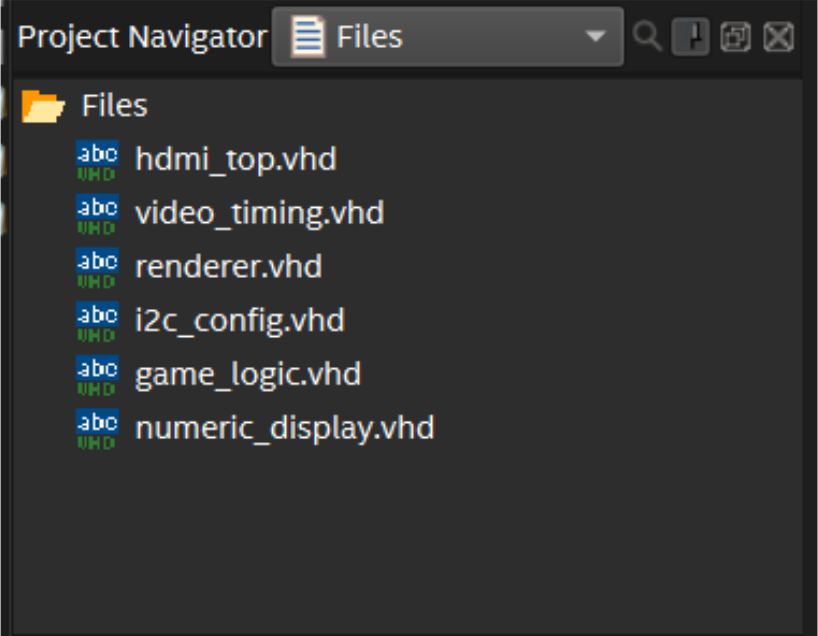

# Project setup

To begin the workshop, download and unzip the skeleton project file, available here. The skeleton project contains some files to save time during the workshop. 

More information about what each file does and how they work will be shared as they are used. For those interested in learning more, feel free to examine the VHDL files and the appendices in this document. 

After opening the project, the file explorer should look like this: 

