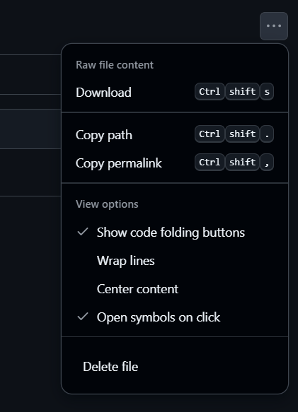

# Project setup

Before we do anything, you need to download and open the skeleton project in Quartus for this workshop. The skeleton project contains some pre-written files to save time during the workshop. 

---

## 1. Download the ZIP file
To begin the workshop, download and unzip the skeleton project file, that is available [here](../FPGA%20Pong%20Game%20Skeleton.zip).

Click the **Download** button in the top-right corner to download the ZIP file.

## 2. Open the Project

Go to Quartus and open the project. If you have forgotten how to open projects in Quartus you can refer to [the Introductory FPGA Workshop](../../Introductory%20Workshop/01_project_setup.md/#Project%20Setup%20for%20Activities%201-3).

## 3. Verify that you have all the needed files

The file explorer in Quatus should look like this: 

More information about what each file does and how they work will be shared as we go through this workshop. 

For those interested in learning more, feel free to examine the VHDL files and these [appendices](../appendices/). 

---
|Back: [Introduction](../README.md) | [Top](../README.md) |Next: [Phase-Locked Loop IP core](02_phase_locked_loop.md)|
|---|---|---|