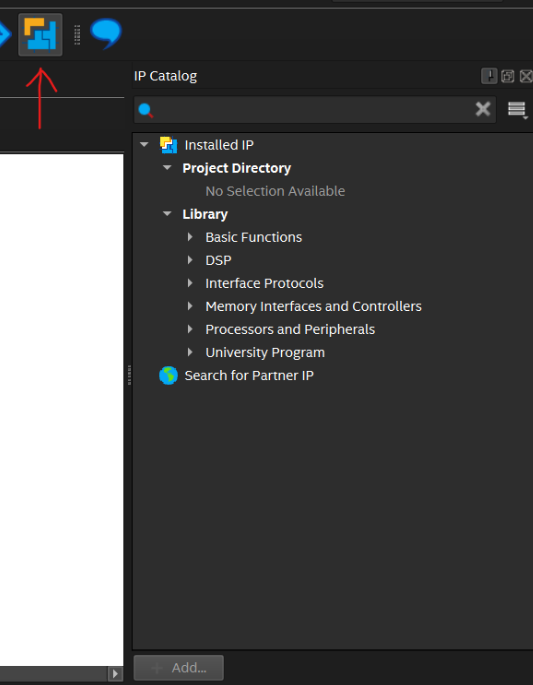
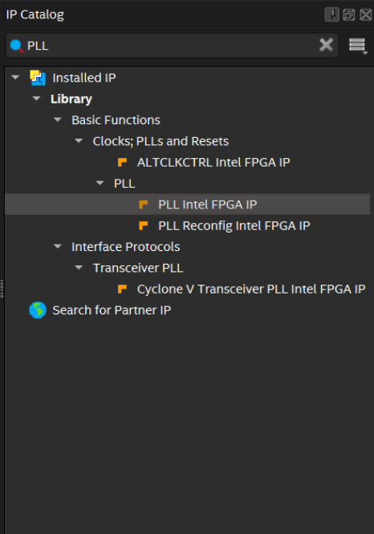
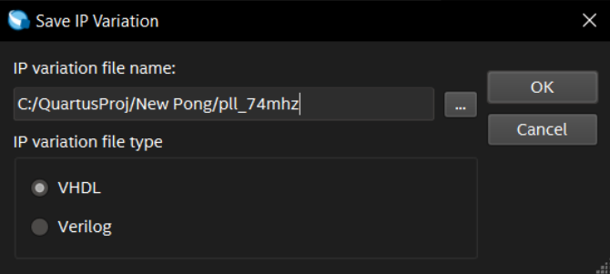
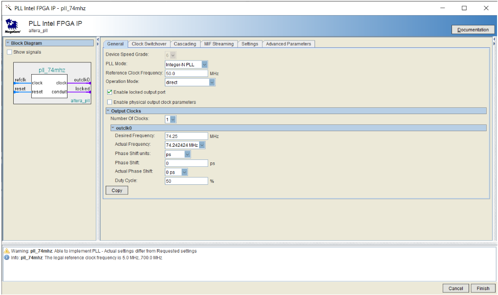
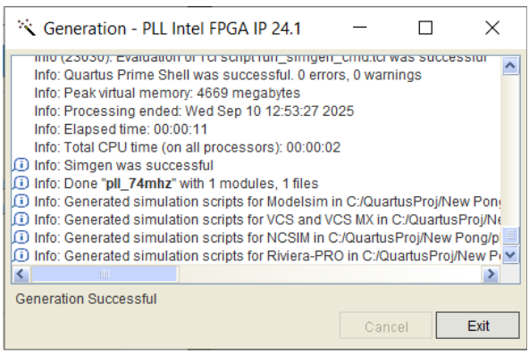
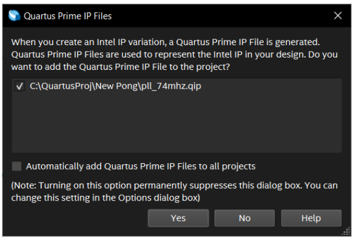
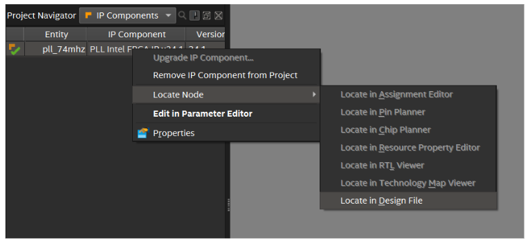
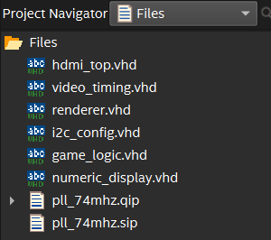

# Phase-Locked Loop IP core

In this part, we will learn how to set up an IP core from the Altera IP library. 

## What is an IP Core?
Intellectual property (IP) cores are reusable logic components for use in FPGA/IC/ASIC design that are the intellectual property of another party. 

Designers can obtain a license to use IP cores for use in their designs, offering designers the advantage of a pre-built, pre-tested logic component. They can drastically reduce the development time of hardware designs, and as such are widely used in industry. 

Intel Quartus Prime Light comes packaged with a small library of IP cores with varying licenses. The included IP cores include cores for DSP, interface protocols, among others. It also includes the Nios family of soft-core processors; these are customizable processors implemented in HDL for the Altera family of FPGAs. 

## Why do we need a Phase-Locked Loop?

Several logic components we use in this workshop require a 74.25MHz clock. However, the development board we are using only includes a 50MHz internal clock. To generate a 74.25MHz signal from the provided 50MHz signal, we will use a device called a phase-locked loop (PLL). 

At its core, a PLL generates a clock that is in-phase with another clock. Using clock dividers to pre-scale the input and feedback, a PLL may generate new clock frequencies at their output that do not drift over time with respect to their input clocks. To learn more about PLLs, see [Appendix C](../appendices/appendix_c.md). 

Instead of writing this component from scratch, we can use a pre-built, pre-tested component from the Altera IP library. To do so, we use the IP library in Quartus. 

## How to add Phase-Locked Loop from IP library
1. Open the IP Catalogue using the Open IP Catalogue button (see below) or by pressing **Alt+7.** 

    **Note:** it may already be open in your project on the right.

    

2. Search the IP Catalogue for **PLL Intel FPGA IP** and select it from the list. 

    

3. In the popup, choose a name for the generated IP variation (here, we chose `pll_74mhz`) and select the VHDL radio button. Then, press **OK**. 

    

4. Wait for the MegaWizard to load. This may take a couple seconds. 

5. In the MegaWizard, change the following parameters: 
    * Reference Clock Frequency: **50.0 MHz** 
    * Desired Frequency: **74.25 MHz** (the actual frequency will auto-select to 74.242424 MHz after inputting the desired frequency) 

    

6. Click finish. Await the **“Generation Successful”** message in the Generation window that appears. 

    

    **Troubleshooting:**
    
    Sometimes Quartus reports a generation error or failure even if the generation was successful. As long as the popup in the next step appears, you are good to continue. 

7. If you receive a popup asking to add the generated IP variation file to the project, check the box and press **Yes**.

    

8. The PLL IP variation is now available to use as a component in the project. 

    To see the generated design files, find the project navigator (on the left of the screen). In the dropdown menu at the top of the project navigator, select **IP Components**. Right click on the PLL component you just generated and select **Locate Node > Locate in Design File** to open the generated design file.  

    

9. If you have completed these steps sucessfully. You should see this in your project's file directory:

    

---
You will instantiate and connect this PLL in a later step.

---
Next: [Overview: Setting Up Video over HDMI](../video_hdmi/03_video_hdmi_overview.md)

|Back: [Project setup](01_project_setup.md) | [Top](../README.md) |Next: [Overview: Setting Up Video over HDMI](../video_hdmi/03_video_hdmi_overview.md)|
|---|---|---|