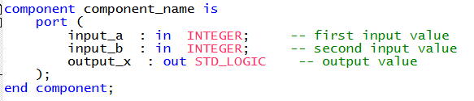
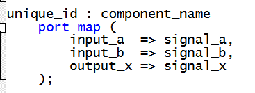
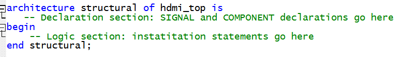
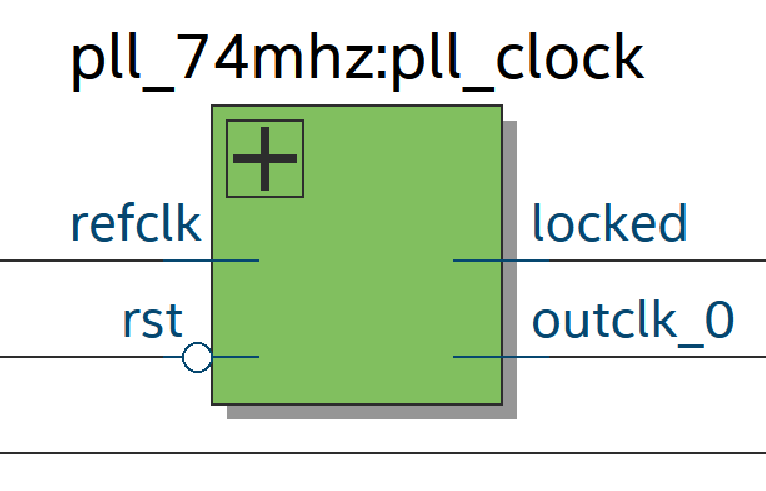

# Add Phase-Locked Loop to Top-Level File

In this step, you will add the Phase-Locked Loop (PLL) IP core to the top-level file: `hdmi_top.vhd` so that the system can generate the 74.25 MHz pixel clock required for HDMI output.

## What is a Component Instatiation? 

Previously we talked about how we can use pre-built components in VHDL to create larger systems. VHDL provides a mechanism called component instatiation to perform this task. 

There are two parts to component instantiation: defining the component and instantiating it in the design.

### Component Definition Syntax



### Component Instantiation Syntax



## How to Instantiate PLL in `hdmi_top.vhd`

Before adding the PLL, recall the general structure of an architecture body. If you have forgotten what architectures are in VHDL, you can refer to the Introductory FPGA Workshop's [architectural body section](../../Introductory%20Workshop/00_introduction.md#architectural-body).


In `hdmi_top.vhd`, the architecture body consists of:
- A declaration section (before `begin`) for signals and component definitions
- A logic section (between `begin` and `end`) for instantiation statements and signal assignments



### 1. Write the Component Definition

In the **declaration section** of the architecture body, add the following component definition. This informs Quartus that, somewhere in our project, there’s a component named `pll_74mhz` with two input ports and two output ports of the STD_LOGIC type. 

This can be copied and pasted into the coresponding section: 
````VHDL
-- pll_74mhz component definition
component pll_74mhz is
	port (
		refclk   : in  STD_LOGIC; --  refclk.clk
		rst      : in  STD_LOGIC; --  reset.reset
		outclk_0 : out STD_LOGIC; --  outclk0.clk
		locked   : out STD_LOGIC  --  locked.export
	);
end component;
````
### 2. Declare Internal PLL Signals

Still in the **declaration section**, add internal signals to connect to the PLL. 

This can be copied and pasted into the corresponding section: 
````VHDL
-- pll_74mhz signals
signal reset : STD_LOGIC;      -- resets input to the PLL
signal clk_pixel : STD_LOGIC;  -- the 74.25 MHz clock output from the PLL
signal pll_locked : STD_LOGIC; -- tells you when the PLL is stable and usable
````

If you have forgotten signals in VHDL, you can refer to the [Introductory FPGA Workshop](../../Introductory%20Workshop/Activities/activity_1.md#signals). 

### 3. Drive the PLL Reset Signal

Since `reset` is an input to our PLL clock, we must drive it ourselves. In the **logic section**, drive the reset to the opposite value of `cpu_reset_n`, since the default behavior of the reset button is active-low.

This can be copied and pasted into the corresponding section: 
````VHDL
-- drive reset active-high 
reset <= not cpu_reset_n;
````

### 4. Instantiate the PLL

In the **logic section** (i.e., after the begin keyword), copy and paste this instatiation: 

````VHDL
-- pll_74mhz instantiation
pll_clock: pll_74mhz
	port map (
		refclk 	    => clock_50_b5b,
		rst 		=> reset,
		outclk_0    => clk_pixel,
		locked 	    => pll_locked
	);
````

Instantiation tells Quartus to generate logic gates to implement the PLL, and how to connect its inputs and outputs.

In this case, we’re connecting an internal 50 MHz clock to the `refclk` port, our reset signal to the `rst` port, our pixel clock to the `outclk_0` port, and our PLL locked signal to the `locked` port. 

### 5. Compile and Verify 
Open the RTL Viewer in Quartus and inspect the generated hardware connections: 



If you have forgotten how to use the RTL viewer in Quartus, you can refer to the [Introductory FPGA Workshop](../../Introductory%20Workshop/Activities/activity_1.md#helpful-tip). 

---
Next: [Add Local VHDL files to Top-Level File](05_instatiate_local_vhdl.md)