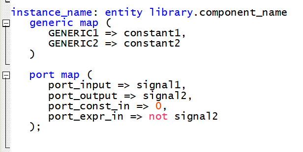
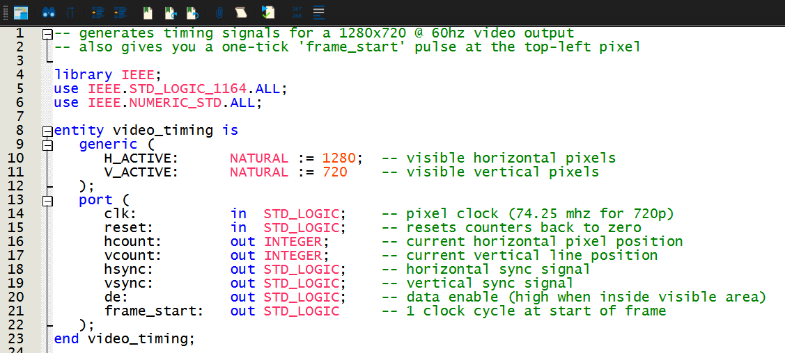
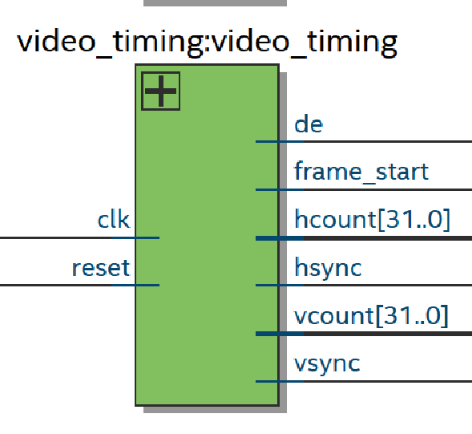
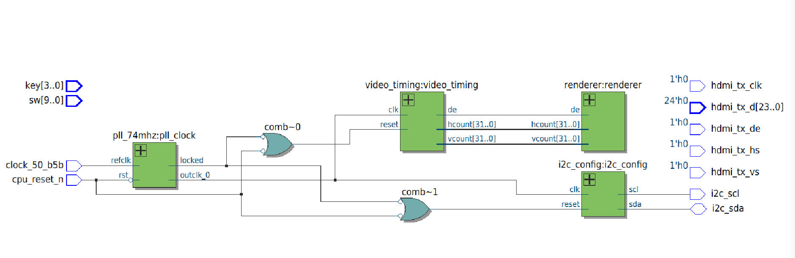

# Add Local VHDL files to Top-Level File
In this step, you will instantiate three local modules in `hdmi_top.vhd`:
- `video_timing` 
- `i2c_config` 
- `renderer` 

These modules are provided because in real FPGA projects you typically reuse existing, tested implementations for standard interfaces like video timing and I2C communication.

## What is Entity Instantiation? 

Unlike component instantiation, entity instantiation is a more direct way to use a module in VHDL. Instead of defining a component first, you reference the actual entity directly when creating an instance.

### General Syntax



### Key notes
- We use the `work` library when we want to use the default local project library
- The `generic map` can be omitted when using the entity’s default generic values

## How to instantiate `video_timing` in `hdmi_top.vhd`

### 1. Identify input and output signals

We need to know what are the input and output signals for `video_timing`. We can do this by navigating to `video_timing.vhd` and looking at it's **entity declaration** which essentially outlines it's inputs and outputs. 

The **entity declaration** in `video_timing` looks like this: 



Notice how the ports in the entity declaration match the input and outputs of the block diagram for `video_timing`



### 2. Set up input and output signals

In the **declaration section** , we need to add the inputs and outputs we identified to support our video timing generator.

We do **not** need to declare new signals for the `clk` and `reset` inputs. These will be connected later when instantiating the module. The clock and reset wiring will be explained in that step.

You can copy and paste this into the corresponding section:
````VHDL
-- video timing signals
signal hcount : INTEGER; -- current horizontal pixel position
signal vcount : INTEGER; -- current vertical pixel position
signal hsync, vsync, de, frame_start : STD_LOGIC; 
````

### 3. Write instantiation

In the **logic section**, copy and paste this instantiation: 

````VHDL
-- video timing instatatioin  
video_timing: entity work.video_timing 
	port map(
		clk => clk_pixel, 
		reset => (not pll_locked) or reset, 
		hcount => hcount, 
		vcount => vcount, 
		vsync => vsync, 
		hsync => hsync, 
		de => de, 
		frame_start => frame_start
	);
````

### Helpful notes
We use the PLL output `clk_pixel` as the clock input. The reset input is driven by `(not pll_locked) or reset`, ensuring the component resets when the PLL is not locked or when the reset button is pressed.

The same clock and reset is used for the other local components in the project, such as `i2c_config` and `renderer`.

## Your Turn 

### 1. Instantiate `i2c_config` in `hdmi_top.vhd`

Use the same steps that we went through for `video_timing` to instantiate `i2c_config`. 

You should also know that we do **not** need to add new signals for the output of this component, instead we will connect the outputs of `i2c_config` to the existing signals: `i2c_scl` and `i2c_sda`.  

This can be copied and pasted into the corresponding section: 
````VHDL
scl => i2c_scl, 
sda => i2c_sda
````

Here is the block diagram for `i2c_config` to help you: 


#### Reminder: Clock and Reset Wiring
- **All the local components** in this project use `clk_pixel` (the output of the PLL) as their `clk` input. 
- **All local components** in this project use `(not pll_locked) or reset` as their `reset` input. 

### 2. Instantiate `renderer` in `hdmi_top.vhd`

Use the same steps that we went through for `video_timing` to instantiate `renderer`. 

We will set `clk` and `reset` for `renderer` the same way we did it for `video_timing` and `i2c_config`. 

Here is the block diagram for `renderer` to help you:


Notice how the signals for the inputs of `renderer` are the same signals used in the outputs for `video_timing`. Also remember to create the output signal for `rgb` of type STD_LOGIC_VECTOR(23 downto 0). 

#### Ignore all game logic signals for now

We will be ignoring all the game logic signals (`pl_y` , `pr_y`, `ball_x`, `ball_y`, `score_l`, and `score_r` ) for `renderer` because right now we're just trying to get the display working on HDMI. 

### 3. Compile and Verify
Now, compile the project and resolve any errors. The board will not display anything over HDMI yet. 

However, you can use the RTL Viewer and compare your design to the screenshot below to verify your implementation.



---
Next: [Connecting the FPGA to an HDMI Monitor](06_display_over_hdmi.md)