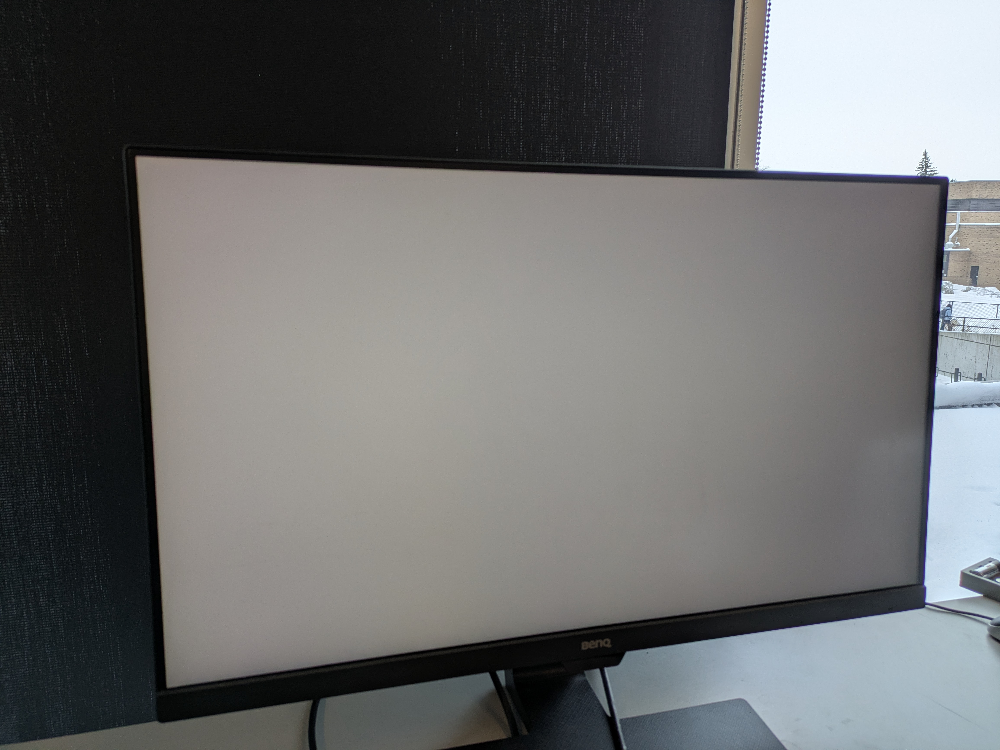
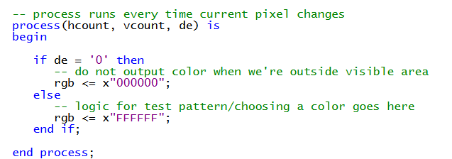
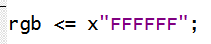

# Connecting the FPGA to an HDMI Monitor

Now that the HDMI-related components have been instantiated, we need to connect their outputs to the ADV7513 HDMI encoder on the FPGA board.

## Background: ADV7513 HDMI encoder

We use to I2C communication in this workshop for the ADV7513 HDMI encoder which is a chip on the FPGA board. This chip allows us to interface with an HDMI-enabled display. Over I2C communication, we send display data over a parallel interface (consisting of 24 bits of RGB data, horizontal and vertical sync signals, a pixel clock, and a data enable signal). 

##  How to Connect Video Signals in `hdmi_top.vhd`
Assign the output signals `hdmi_tx_de`, `hdmi_tx_hs`, `hdmi_tx_vs`, and `hdmi_tx_clk` to `de`, `hsync`, `vsync`, and `clk_pixel`, respectively in the **logic section** of the architecture body in `hdmi_top.vhd`.

You can copy and paste this into the corresponding section: 
````VHDL
-- wiring HDMI tx to generated video signals
hdmi_tx_de <= de;
hdmi_tx_hs <= hsync;
hdmi_tx_vs <= vsync;
hdmi_tx_clk <= clk_pixel;
hdmi_tx_d <= rgb;
````
Compile and upload your program to the board. This may take a moment. If it is working correctly, the board should be displaying a completely white screen over HDMI. 



#### Helpful note 

You can use the RTL Viewer and compare your design to the screenshot below to verify your implementation.


## Your Turn: Display a Test Pattern

With the HDMI system working, we will now write some logic to display a pattern over HDMI. We will use the provided `renderer` component to interface with the video timing signals and choose a color for each pixel on the display.

### 1. Identify Where to Add Code in`renderer.vhd`

Open `renderer.vhd` and go to down to its **process**. If you have forgotten how processes work in VHDL, you can refer [here](../../Introductory%20Workshop/Activities/activity_2.md#process). 



Here's some key notes about the code: 
- `hcount`: the horizontal/x position of the current pixel
- `vcount`: the vertical/y position of the current pixel
- `de`: whether we should be drawing to the screen
- `rgb`: the RGB color to draw on the pixel specified by `hcount` and `vcount`

### 2. Write a test pattern
For this part of the project, you will write logic to display a pattern in `renderer`. Feel free to be creative and try something without knowing what the result will be. 

You can do this by replacing this: 



with your test pattern. 

Some options for ways to generate the pattern include: 
- Assigning red, green, and blue values based on bits in `hcount` and `vcount` 
- Color every other pixel white, alternating colors every frame 
- Draw a checkerboard with different size squares in red, green, and blue

**Warning**: this step may produce flashing patterns that can trigger seizures for people with photosensitive epilepsy.

### Helpful notes

In VHDL, INTEGER types cannot be indexed, so `renderer` includes two signals (`hcount_vec` and `vcount_vec`) that are STD_LOGIC_VECTOR versions of `hcount` and `vcount`.  Use these if you need to access certain bits of `hcount` and `vcount` in your test pattern logic. 

One example of a simple test pattern that you can copy and paste would be: 
````VHDL
-- logic for test pattern/choosing a color goes here
rgb(7 downto 0)   <= hcount_vec(7 downto 0); 
rgb(15 downto 8)  <= hcount_vec(9 downto 2); 
rgb(23 downto 16) <= vcount_vec(7 downto 0); 
````

### 3. Compile and Verify 
Compile and upload your program to the board. This may take a while. If it is working correctly, the board should be displaying a test pattern: 


This screenshot is displaying the provided example test pattern but you can also just display a different solid colour or something else if you wish. 

---
Now that we've connect our FPGA board to our display, we can now start drawing objects!

---
|Back: [Add Local VHDL files to Top-Level File](05_instatiate_local_vhdl.md) | [Top](../README.md) |Next: [Drawing Rectangles on the Screen](07_draw_rectangles.md)|
|---|---|---|