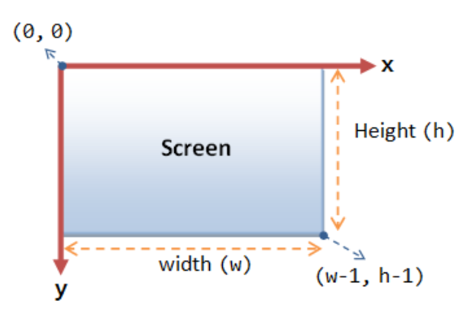
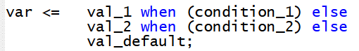
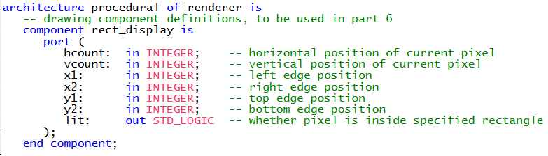
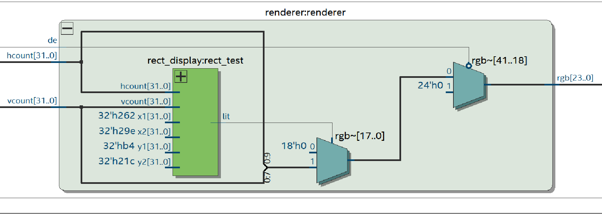
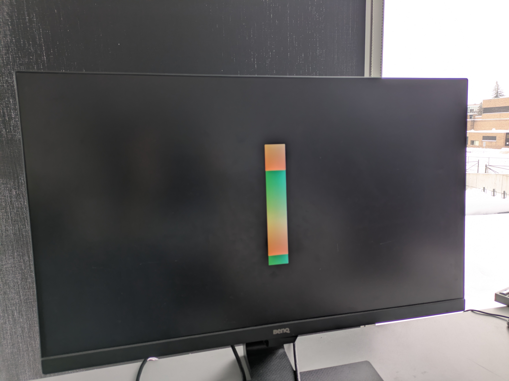

# Drawing Rectangles on the Screen

In this section, you will get an opportunity to write your own module and integrate it with the rest of the logic. We will write a module to help display a rectangle at an arbitrary position on-screen. 

Later in the workshop, this same module will be reused to draw the **ball and paddles** for the game.

## How Do Computer Graphics Work?

Displays are (typically) made up of grids of square pixels. Each pixel can display a range of visible colors by combining varying levels of red, green, and blue light. To see how these elementary colors combine to form different colors, see this interactive tool. 

For most display applications, a standard coordinate system is used to describe the position of a pixel. 

In this coordinate system, `(0,0)` is the top-left corner of the screen. The x-axis increases from left to right, from `0` to `width - 1`, where width is the width of the screen in pixels. Similarly, the y-axis increases from top to bottom, `0` to `height-1`. 




## Writing the `rect_display` VHDL Module

### 1. Create the `rect_display` component

In Quartus, create a new VHDL file in the current project called `rect_display.vhd` and include the following: 

### Library and packages

````VHDL
library IEEE; 
use IEEE.STD_LOGIC_1164.ALL; 
use IEEE.NUMERIC_STD.ALL; 
````
### Entity declaration
Define an entity with:
- Six INTEGER inputs describing the current pixel position and rectangle boundaries
- One STD_LOGIC output indicating whether the pixel is inside the rectangle

The internal signals that need to declared are the following:  
- `hcount`: x-pos of current pixel
- `vcount`: y-pos of current pixel 
- `x1`: x-pos of left side of rectangle 
- `x2`: x-pos of right side of rectangle
- `y1`: y-pos of top of rectangle 
- `y2`: y-pos of bottom of rectangle 
- `lit`: whether the current pixel is on the rectangle 

````vhdl
entity rect_display is
	port (
        -- Fill in your input and output signals here
	);
end rect_display;
````

### Architecture body

Write logic to set the output signal: `lit` to `'1'` when the current pixel is in the rectangle, `'0'` otherwise. 

As you write this logic, think about whether the x and y-coordinates of the current pixel are inside the region defined by the rectangle’s boundaries.

**It is  useful to know that the monitor used in this design has the resolution: 1280 x 720 pixels.**

````vhdl
architecture procedural of rect_display is
	begin
    -- Fill in your logic here
end procedural;
````
#### Key notes: Conditional Assignment

It may be useful to know the syntax of conditional assignment, which allows conditional behavior without using a process:



This syntax will assign `val_1` to `var` when `condition_1` is met, `val_2` when `condition_2` is met, and so on. It will assign `val_default` if none of the conditions are met. 

If more than one condition is met, then the topmost value will be prioritized. When this logic is synthesized (converted from HDL into logic elements for the FPGA), it will become a multiplexer element. 

### 2. Use `rect_display` component in `renderer.vhd`


### 2.1 Open `renderer.vhd`

Open `renderer.vhd` in your current project. 

Notice that in `renderer.vhd`, we've already provided the component definition for `rect_display`: 



### 2.2 Declare the rectangle output signal

You must now create a signal to store the `lit` output from `rect_display`

````vhdl
signal on_rect : STD_LOGIC;
````

### 2.3 Instantiate `rect_display` component
You need to now write the instantiation for a copy of your rectangle component (like you did for the PLL in Part 1). 

````vhdl
test_rect : rect_display
  port map (
    -- Fill in the rest of your input and output signals here
    lit => on_rect
  );
````

Here is the block diagram that you may find useful: 



### 2.4 Use lit to draw the rectangle

Replace the test pattern you wrote earlier with logic that uses the `lit` output (that is being stored in `on_rect`) to draw a rectangle on screen. 

The `lit` output from `rect_display` tell you whether the current pixel is inside the rectangle's boundaries and is used by `renderer` to color only those pixels, with all others left black.

### 2.5 Compile and Verify

Compile and upload your program to the board. If it is working correctly, the board should be displaying a rectangle similar to this:



The above example has a rectangle with the following bounds: 
- `x1`: 610 pixels
- `x2`: 670 pixels
- `y1`: 180 pixels
- `y2`: 540 pixels

---
If you can successfully display a rectangle, continue to the next part to implement our Pong game!