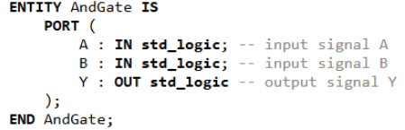
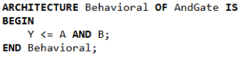

# Introduction to FPGAs and Quartus

## What is an FPGA?

FPGA stands for Field-Programmable Gate Array. It's a special kind of chip that you can program to do almost any digital task by wiring it up the way you want—kind of like building your own custom circuit inside a chip. Unlike a microcontroller, which runs one set of instructions step by step (like a tiny computer), an FPGA lets you create many operations that can all run at the same time. This makes FPGAs great for things that need to be fast or happen all at once, like video processing or controlling hardware. People choose FPGAs when they need more speed, more control, or special features that regular microcontrollers can't handle.

## What is VHDL?

VHDL stands for Very High-Speed Integrated Circuit Hardware Description Language. VHDL is an HDL (Hardware Description Language) and is used to program digital circuits. Unlike Python, Java and C, which use whatever hardware they are on to implement software, HDLs describe the function and structure of a digital circuit hardware. Like any other programming language you have seen, VHDL has a particular syntax that must be followed.

## Inputs and Outputs

In VHDL, inputs and outputs are how your circuit communicates with the outside world. When you describe a digital circuit in VHDL, you need to tell the computer what signals come in (inputs) and what signals go out (outputs). This is done in the entity section of your VHDL code.

Inputs are values that the circuit receives (like buttons, switches, or signals from other circuits).

Outputs are values that the circuit sends out (like turning on a light or sending a signal to another component).

## Design Entity

An entity is a VHDL building block that defines all the inputs and outputs of the overall system. Think of it as a black box which is a representation of a system that relies entirely on inputs and outputs.

There can only be one entity definition per file. The name of an entity should always be the file name. Notice that only the last element in the list is not followed by a semicolon – this is relevant to the syntax and occurs in other blocks. Everything inside the PORT brackets defines the inputs and outputs of the VHDL file.

In the image below, inputs and outputs are declared as std_logic which means they can be 0 or 1 value.



## Architectural Body

The architectural body in VHDL is the part of the code that describes what the circuit actually does. It is connected to an entity, which defines the overall inputs and outputs.

You can think of the entity as the outside of a box (the ports), and the architecture as what's happening inside the box (the logic).



## Libraries

Like standard programming languages, VHDL uses libraries for added functionality. For our purposes, we will be using one library: IEEE, specifically std_logic_1164, and numeric_std. The IEEE library defines a bunch of functionalities as regulated by the Institute of Electrical and Electronics Engineers. The std_logic library defines relevant data types and functions, while numeric_std allows for arithmetic operations. You will not need the numeric library until the bonus activity.

```vhdl
LIBRARY IEEE;
USE IEEE.STD_LOGIC_1164.ALL;
```

## Boolean Expressions

Boolean expressions are logical statements that combine input signals to determine an output. They use logic operations like AND, OR, NOT, and XOR, which are the building blocks of all digital circuits.

The assignment operator in VHDL is "<=" and it is used to assign a value to a signal.

| Operator | Meaning | VHDL Example |
|----------|---------|--------------|
| AND | Logical AND | Y <= A AND B; |
| OR | Logical OR | Y <= A OR B; |
| NOT | Logical NOT | Y <= NOT A; |
| NAND | NOT AND | Y <= A NAND B; |
| NOR | NOT OR | Y <= A NOR B; |
| XOR | Exclusive OR | Y <= A XOR B; |
| XNOR | Exclusive NOR | Y <= A XNOR B; |

NOTE: NAND and NOR gates can also be expressed as an AND or OR gate, respectively, followed by a NOT gate, with intermediate values stored using signals. You are also not limited to a single operation per line.

## Sample VHDL Program

Here's a sample program that shows you how the library, design entity, architectural body and Boolean expressions all go together:

```vhdl
LIBRARY IEEE;
USE IEEE.STD_LOGIC_1164.ALL;

ENTITY SimpleLogic IS
    PORT (
        A : IN STD_LOGIC;
        B : IN STD_LOGIC;
        Y : OUT STD_LOGIC
    );
END SimpleLogic;

ARCHITECTURE Behavioral OF SimpleLogic IS
BEGIN
    Y <= A AND B;
END Behavioral;
```

---

|Back: [Workshop Home](README.md) | [Top](README.md) |Next: [Project Setup](01_project_setup.md)|
|---|---|---|