# Testing out the System

## Creating your First VHDL Project

Your first VHDL project is to implement the Boolean example below. You'll map the A and B inputs to switches and each of the four outputs to an LED. You will reuse these steps in the later activities to create new projects.

```vhdl
LIBRARY IEEE;
USE IEEE.STD_LOGIC_1164.ALL;

ENTITY BooleanExample IS
    PORT (
        SW : IN STD_LOGIC_VECTOR(1 DOWNTO 0);
        LEDR : OUT STD_LOGIC_VECTOR(3 DOWNTO 0)
    );
END BooleanExample;

ARCHITECTURE Behavioral OF BooleanExample IS
BEGIN
    LEDR(0) <= SW(0) AND SW(1); -- AND
    LEDR(1) <= SW(0) OR SW(1); -- OR
    LEDR(2) <= SW(0) XOR SW(1); -- XOR
    LEDR(3) <= NOT SW(0); -- NOT A
END Behavioral;
```


## Create a new project

1. Launch Quartus Prime from your computer.
2. Create a New Project
    * Click <b>File > New Project Wizard</b>

    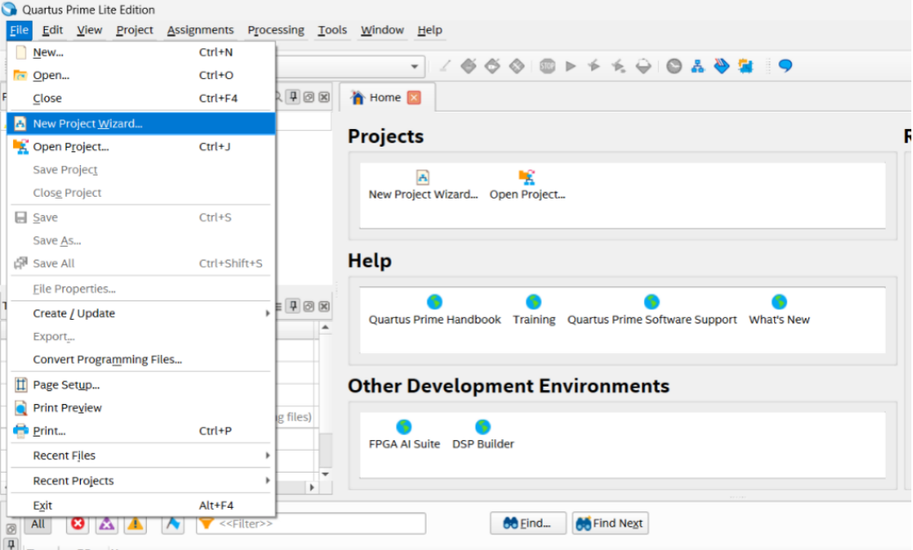

    * Click Next to start the wizard. You should see a screen that looks like this:

    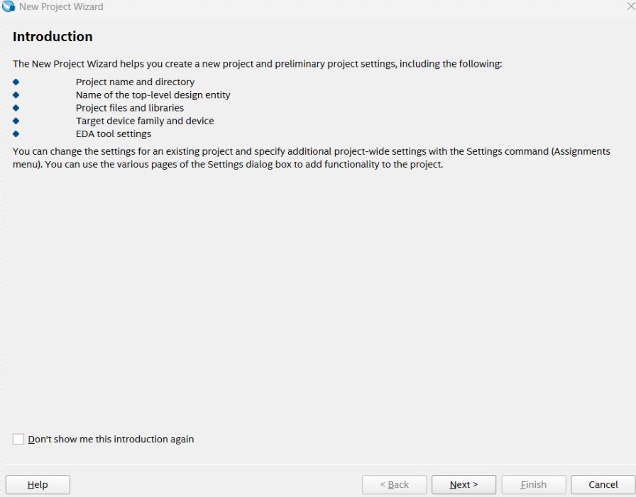

3. Setup Wizard
    1. Create a folder named <b>FPGA_Projects\BooleanExample</b> in your C drive where your project will be saved. (C:\FPGA_Projects\BooleanExample)

    2. Give your project the name: <b>BooleanExample</b>

    3. Click <b>Next</b>

    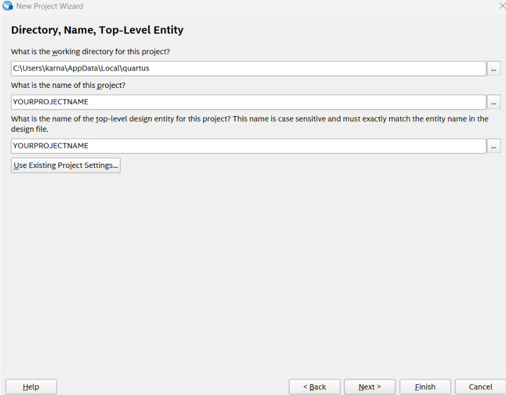

    4. Select <b>Empty Project</b> and click <b>Next</b>.

    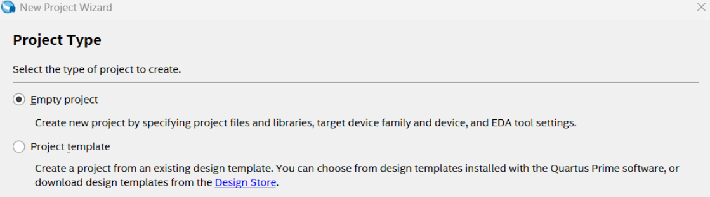

    5. Click <b>Next</b>. We will skip the Add Files section.

    Now you need to choose your specific FPGA chip. We use the Cyclone V GX Starter Kit.

    6. Go to the <b>BOARD</b> tab and select Cyclone V GX Starter Kit
    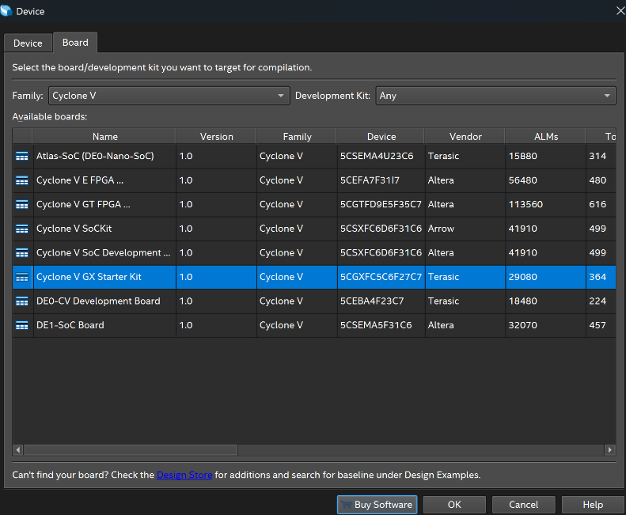
    7. Click <b>Next</b>

    8. Ensure the '<b>Simulation</b>' has '<b>Questa Intel FPGA</b>' and '<b>VHDL</b>' selected. 'Verilog HDL' may be selected by default make sure you change this.

    9. Click <b>Next</b> 
    10. Click <b>Finish</b> to complete project setup.

## Create a New VHDL File

You are ready to create a VHDL file now. Click File > New

Choose VHDL File then Click OK

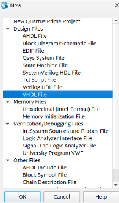

## Test out this BooleanExample code in your VHDL file

```vhdl
LIBRARY IEEE;
USE IEEE.STD_LOGIC_1164.ALL;

ENTITY BooleanExample IS
    PORT (
        SW : IN STD_LOGIC_VECTOR(1 DOWNTO 0);
        LEDR : OUT STD_LOGIC_VECTOR(3 DOWNTO 0)
    );
END BooleanExample;

ARCHITECTURE Behavioral OF BooleanExample IS
BEGIN
    LEDR(0) <= SW(0) AND SW(1); -- AND
    LEDR(1) <= SW(0) OR SW(1); -- OR
    LEDR(2) <= SW(0) XOR SW(1); -- XOR
    LEDR(3) <= NOT SW(0); -- NOT A
END Behavioral;
```

## Save your VHDL File

Select File > Save As

Enter BooleanExample

Click Save as type > VHDL File

Ensure you the box to add your file to the project is checked.

Click Save

## Compilation

Click Processing > Start Compilation or click the blue play button (Compilation is a very slow process expect it to take >30 seconds)

Compilation will provide a success prompt. Please fix any errors that appear in the terminal and then re-compile.

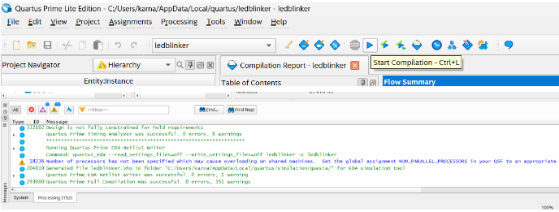

## Top File Entity

Select Assignments > Settings > General

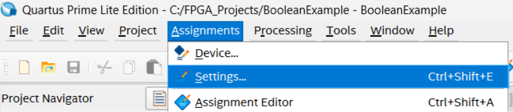

Replace the default top file entity by selecting the 3 dots.

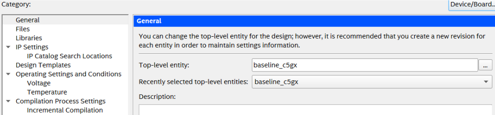

Click on your new top file entity (BooleanExample). Select OK.

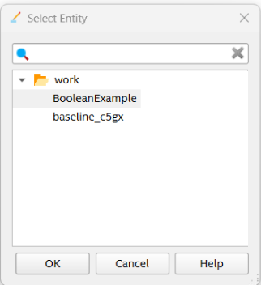

Select OK again.

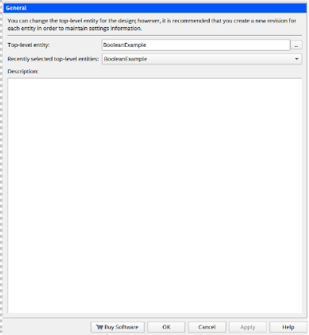

Select Processing > Start Compilation again.

## Programming the FPGA

Go to Tools > Programmer

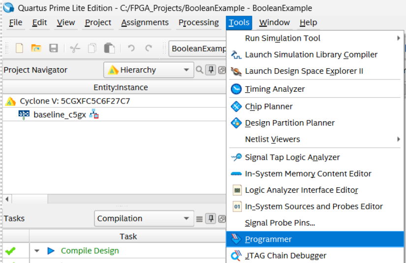

### Check Hardware Setup

In the Programmer window, click Hardware Setup (If you see "No Hardware" then click Add Hardware and choose USB Blaster and click OK.

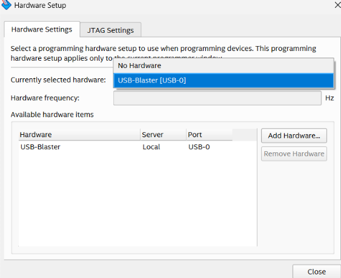

You should see a .sof file. Select this file if it is not already selected by default.

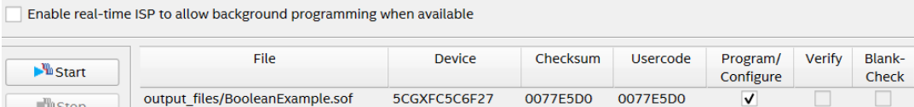

Click the Start button.

Your program will be uploaded to the board once the progress bar reaches 100%.

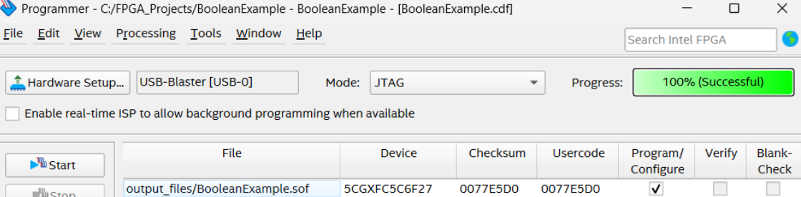

## Verify Your Results

After successfully uploading your program, please verify that you are receiving the expected outputs below.

| Inputs |  |  | Outputs |  |
|--------|--|--|---------|--|
| SW(1) | SW(0) | Operators | LED is ON |
| 0 | 0 | NOT | LEDR(3) |
| 0 | 1 | OR, XOR | LEDR(2), LEDR(1) |
| 1 | 0 | NOT, OR, XOR | LEDR(3), LEDR(2), LEDR(1) |
| 1 | 1 | OR, AND | LEDR(1), LEDR(0) |

---

## Project Setup for Activities 1-3

For the next three activities (Activities 1-3), you will be working within a single Quartus project that contains skeleton files to help guide your learning.

### Opening the Project

1. Navigate to the `Introductory Workshop/Activities/FPGA_Activities_1-3` folder in github and download it.

2. Open Intel Quartus Prime.

3. In Quartus, go to **File → Open Project**.

4. Browse to the `FPGA_Activities_1-3` folder and open the project file (`.qpf` extension).

### Setting the Top-Level Entity

Once the project is open, you need to set the correct top-level entity:

1. In Quartus, go to **Project → Set as Top-Level Entity**.

2. Select `beginner_top` from the list.

3. Alternatively, you can right-click on `beginner_top` in the Project Navigator and select **Set as Top-Level Entity**.

### Project Structure

The project folder contains:
- Skeleton files for each activity
- Pre-configured project settings
- Pin Assignments to prevent overlap

You will be completing these skeleton files as you work through Activities 1-3.

|Back: [Introduction](00_introduction.md) | [Top](README.md) |Next: [Activity 1](Activities/activity_1.md)|
|---|---|---|
