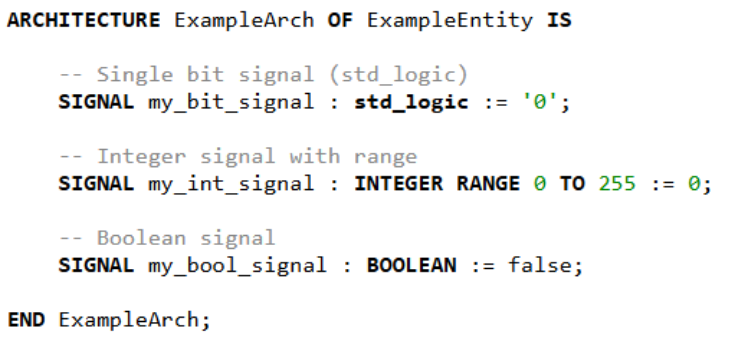
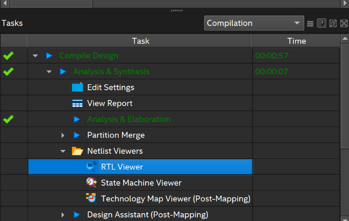
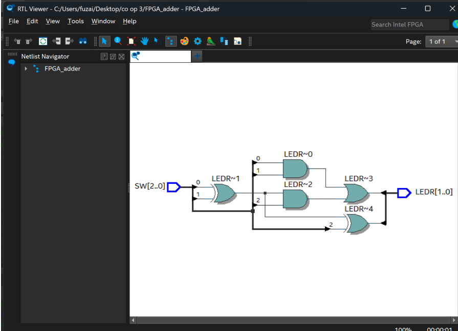

# Activity 1: Creating a Full Adder

## Implementing Circuits

### Signals

Most VHDL code defines a more complex circuit than the gates in the last example. So we need the equivalent of physical 'wires' to connect the gates. In VHDL these 'wires' are called signals.

Each signal you need for your circuit must be declared as a specific data type. It is declared inside the Architecture block. It isn't declared as an input or output because it is just a "wire" between components.

Some datatypes for signals include STD_LOGIC, STD_LOGIC_VECTOR, INTEGER, etc.



Here's what code would look like to implement the circuit X = (A AND B) OR C:

```vhdl
library IEEE;
use IEEE.STD_LOGIC_1164.ALL;

entity LogicExample is
    Port (
      SW : in STD_LOGIC_VECTOR(2 downto 0); -- SW[0] = A, SW[1] = B, SW[2] = C
      LEDR : out STD_LOGIC_VECTOR(0 downto 0) -- LEDR[0] = X
);
end LogicExample;

architecture Behavioral of LogicExample is
    
    --SIGNAL declarations
    signal AB : STD_LOGIC;  -- internal wire for A AND B

begin

    AB <= SW(0) and SW(1);          -- Assigns the logic "A AND B" to the internal wire AB

    --LED(0) assignment
    LEDR(0) <= AB or SW(2);         -- (A AND B) OR C

end Behavioral;
```

## Activity Instructions

The first activity is to implement an FPGA circuit that adds two bits together. Some of you may recognize this as a full adder circuit.


The input will be the switches on your FPGA, where SW0 is input A, SW1 is input B, and SW2 is the Carry In bit. The sum and carry out bits will be output to LEDs 0 and 1 respectively.

Use this table to verify that your circuit is working properly. The first part is completed for you. The Sum is the sum of A+B+Carry In, but because it's only one bit long, when the sum is 2 or 3 there is a carry to the next column (Just like when you learned how to do addition of big numbers back in primary school).

| Input |  |  | Output |  |
|-------|--|--|--------|--|
| A | B | Carry In | Carry Out | Sum |
| 0 | 0 | 0 | 0 | 0 |
| 0 | 0 | 1 | 0 | 1 |
| 0 | 1 | 0 | 0 | 1 |
| 0 | 1 | 1 | 1 | 0 |
| 1 | 0 | 0 |  |  |
| 1 | 0 | 1 |  |  |
| 1 | 1 | 0 |  |  |
| 1 | 1 | 1 |  |  |

## Helpful tip

It's possible to view the logic circuit generated by your VHDL code by doing the following.

1. After compilation, expand the "Analysis & Synthesis" tab shown below
    

2. Expand the "Netlist Viewers" then click on the "RTL Viewer"

    

3. Then you should be able to see the logic circuit that corresponds to your VHDL code

    

|Back: [Project Setup](../01_project_setup.md) | [Top](../README.md) |Next: [Activity 2](activity_2.md)|
|---|---|---|