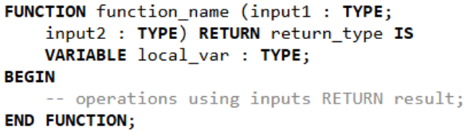
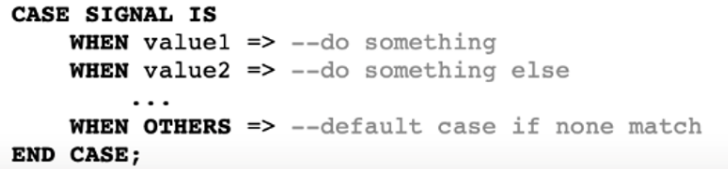

# Activity 4: Binary to Decimal Conversion

Activity 4 uses a separate project folder and introduces binary to decimal conversion.

## Opening the Activity 4 Project

1. Navigate to the `Introductory Workshop/Activitis/FPGA_Activity_4` folder in GitHub and download it.

2. Open Intel Quartus Prime (if not already open).

3. In Quartus, go to **File → Open Project**.

4. Browse to the `FPGA_Activity_4` folder and open the project file (`.qpf` extension).

## Setting the Top-Level Entity

Once the project is open, you need to set the correct top-level entity:

1. In Quartus, go to **Project → Set as Top-Level Entity**.

2. Select activity_4 as the top-level file.

3. Alternatively, you can right-click on the file in the Project Navigator and select **Set as Top-Level Entity**.

## From Digital to Programmed Logic

### Function

A function is a reusable block of code that executes a specific computation and returns a value. VHDL functions are like regular programming languages.



### Case Statement

A case statement is like a multiple-choice decision. It checks the value of a signal or variable and executes different code depending on the value.



### Variables

In VHDL, variables and signals are both used to store data, but they behave differently. Signals represent connections and are used to model hardware wires—they update their values after a delay (in the next simulation cycle). In contrast, variables are used inside processes and update immediately, making them useful for intermediate calculations. Use signals when you want to communicate between processes or drive outputs, and variables when you need quick updates within a single process or function.

In VHDL, := and <= are assignment operators, but they are used in different contexts. The := operator is used to assign values to variables, and the change happens immediately within the process or function. The <= operator is used to assign values to signals, and the change takes effect after the current simulation cycle, reflecting actual hardware behavior. So, use := for quick, local calculations with variables, and use <= when updating signals that represent hardware connections.

## Example Code

This sample code shows the usage of functions and case statements. Again, you can use the syntax of this file as a reference for the following activity.

```vhdl
library IEEE;
use IEEE.STD_LOGIC_1164.ALL;

entity SegExample is
    Port (
        SW   : in  STD_LOGIC_VECTOR(1 downto 0);
        HEX0 : out STD_LOGIC_VECTOR(6 downto 0)      -- 7-seg display (active-low)
    );
end SegExample;

architecture Behavioral of SegExample is

    --SIGNAL declarations    
    signal result : STD_LOGIC;

    -- Function: Convert '0' or '1' (as character) to 7-segment encoding
    function to_seven_segment(bit_char : character) return STD_LOGIC_VECTOR is
        variable seg : STD_LOGIC_VECTOR(6 downto 0);
    begin
        case bit_char is
            when '0' => seg := "1000000";  -- 7-seg for 0
            when '1' => seg := "1111001";  -- 7-seg for 1
            when others => seg := "1111111";  -- blank display (all off)
        end case;
        return seg;
    end function;

begin

    result <= SW(0) and SW(1);

    -- Use function to choose display value
    process(result)
    begin
         if (SW(0) = '0' and SW(1) = '0') then
              HEX0 <= to_seven_segment('X');  -- undefined → blank
         elsif result = '1' then
              HEX0 <= to_seven_segment('1');
         else
              HEX0 <= to_seven_segment('0');
         end if;
    end process;

end Behavioral;
```

## Activity Instructions

The goal of this activity is to input a 10-bit signed number in binary, using the switches on the FPGA, and output the number in decimal form on the seven-segment display.

### Generating Digits

Create a function which takes an integer type input variable, returns a standard logic vector type, and matches it to the seven-digit binary number that will drive the seven-segment display correctly.

To do this, use a case statement, which assigns the correct seven-digit binary number to a variable that is returned by the function. Refer to the examples above for syntax.

### Generating Sign

Create a function that takes a standard logic type input, checks whether it is high or low, and returns a standard logic vector type. 

If the input is high, return a seven-digit binary number that will display a negative sign. Otherwise, return a value that will result in a blank seven-segment display.

### Handling Inputs

A process block that is triggered by the switches has been created in your file. 

We have given you most the body code for this process block. Revise it and ensure you understand the datatype of each variable.

#### Determining the Sign Bit

This part of the code checks whether the most significant bit, the sign bit, is active or not. If it is, it executes the code with converts the binary input from the first 9 switches to decimal and subtracts 512. 

Otherwise, it just converts from binary to decimal. Then, the value is assigned to the signal which carries the signed value, which you defined earlier.

```vhdl
-- convert input (signed 9-bit number with SW(9) as sign indicator)
    if SW(9) = '1' then
        temp_signed := to_integer(unsigned(SW(8 downto 0))) - 512;
    else
        temp_signed := to_integer(unsigned(SW(8 downto 0)));
    end if;
```

This next part will determine whether the value of the input is greater than or less than 0. Based on that, it will assign either a 0 or 1 to the sign bit signal, and calculate the absolute value of the input, then assign it to the signal which was defined to carry the absolute value.

```vhdl
-- Get the absolute value and sign
    if temp_signed < 0 then
        temp_abs := -temp_signed;
        sign_bit <= '1';
    else
        temp_abs := temp_signed;
        sign_bit <= '0';
    end if;
```

#### Decimal Digit Extraction

This section is responsible for decimal digit extraction. It Assigns the absolute value from the signal to the variable defined for temporarily storing values. 

The hundreds digit is extracted and assigned to the signal defined for the hundreds digit by dividing this value by 100. Then it reassigns the value of temp as the remainder of the absolute value of the input divided by 100.

This value is then divided by 10 to extract the tens place and assigned to the signal defined to carry the tens digit.

The digit to be displayed in the ones place is extracted by using remainder division on the temp variable.

```vhdl
-- Break into decimal digits
    temp := temp_abs;
    hundreds <= temp / 100;
    temp := temp mod 100;
    tens <= temp / 10;
    ones <= temp mod 10;
```

Example: Input=237
```vhdl
hundreds <= temp/100; -- 237/100 = 2
temp := temp MOD 100; -- 237 MOD 100 = 37
tens <= temp/10; -- 37/10 = 3
ones <= temp MOD 10; -- 37 MOD 10 = 7
```

### Incorporate Helper Functions

Now that the rest of the code is implemented, it's time to use the helper functions we wrote earlier.

#### Displaying the Sign:

Use the sign-generating function (the one that takes a sign bit and returns the corresponding 7-segment code for "+" or "−").

Apply this function to the signal that holds the sign bit (e.g., '0' for positive, '1' for negative).

Assign the result to the 7-segment display responsible for showing the sign (HEX3).

#### Displaying the Digits (Hundreds, Tens, Ones):

Use the digit-to-7-segment function, which takes an integer from 0 to 9 and returns the correct 7-bit code to display that digit.

Apply this function to each of the digit signals: hundreds, tens, and ones.

Assign the results to the corresponding 7-segment displays for each place value, hundreds on display HEX2, tens on display HEX1, ones on display HEX0.

This brings us to the end of this activity! You can then upload the file to your FPGA and test whether or not you were successful.

Thank you for participating in the Introductory FPGA workshop!
---

|Back: [Activity 3](activity_3.md) | [Top](../README.md) |
|---|---|
