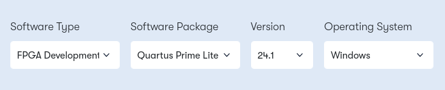
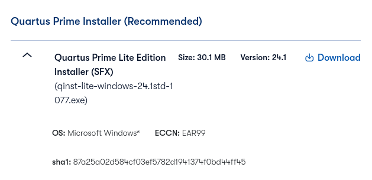
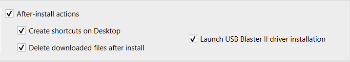
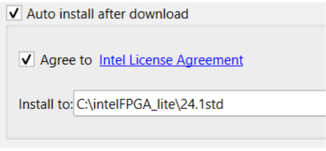
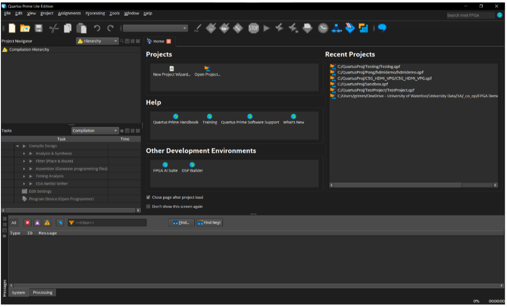
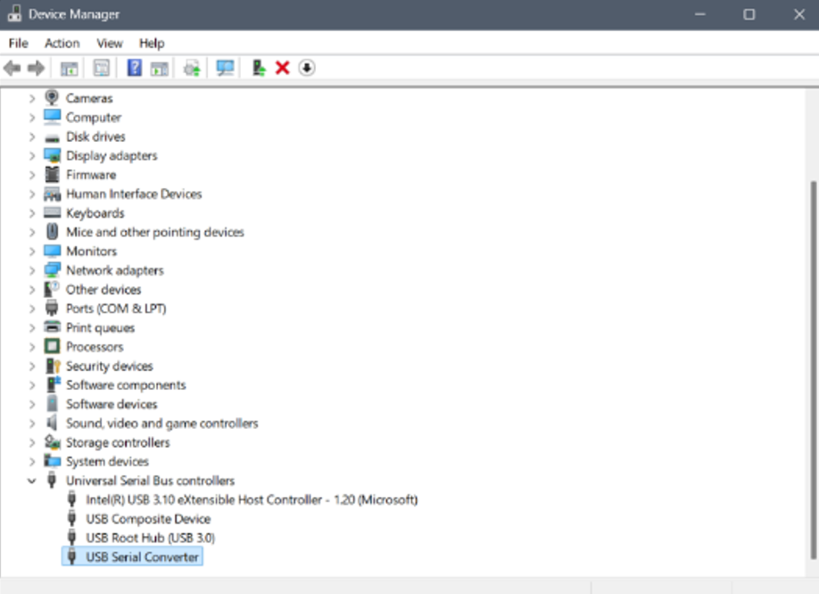
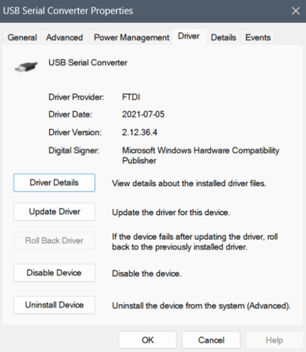
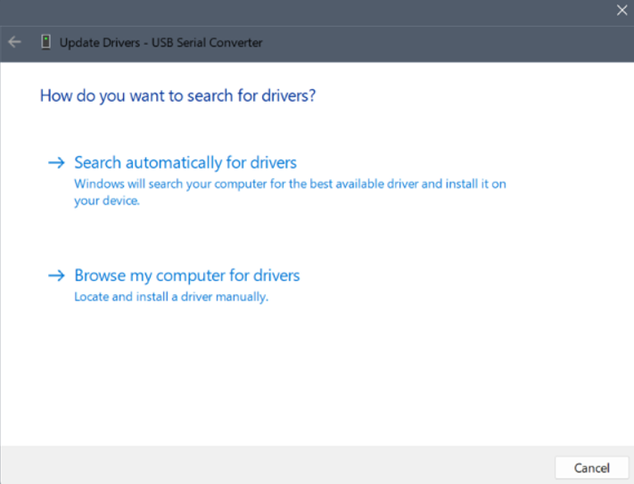

# Setting up Quartus

If you're here, you want to get the necessary tools on your computer to interact with the FPGA board for the [introductory](../fpga_intro/README.md) and [intermediate](../fpga_intermediate/README.md) FPGA workshops.

We recommend using Microsoft Windows to run Quartus. Please install Quartus on a laptop with Windows installed on it so that we may quickly help you troubleshoot steps of the workshop. **macOS is not officially supported by Quartus**.

## Installing Quartus Software for Windows

1. Go to [the Intel FPGA Download Page](https://www.altera.com/downloads/fpga-development-tools/quartus-prime-lite-edition-design-software-version-24-1-windows)

2. Select version `24.1` from the drop-down menu. 
3. Verify that you have selected the following parameters: **FPGA Development < Quartus Prime Lite < 24.1 (Latest) < Windows**

4. Press the download button and accept the legal disclaimer when prompted.  

5. Unzip the program into any folder to begin the set-up process. 

6. Check off the following components. 

7. **Make sure to check the option "Launch USB Blaster II driver installation"** to easily install the programming tool we will use to "flash" the board.

8. Agree to the Intel License Agreement and click **Download and Install**. This installation will take a while to complete. Please be patient.

9. Once the download and installation of Quartus is complete, you should see a window named "Install USB Blaster" by Altera.
   Follow all steps in the new prompt window.

10. Once the download and installation are complete, close the window and open up Quartus. You should see a screen that looks like this:

## Installing Drivers Manually for Quartus

For Quartus to detect your FPGA, you will need to install the USB-Blaster drivers. 

1. Your FPGA will need to be plugged into power, as well as your computer to do this. **MAKE SURE THAT THE USB-B END OF YOUR CABLE IS PLUGGED INTO THE PORT ON YOUR FPGA LABELED AS “USB-Blaster” (The one that is closest to the edge of the board).**
2. Navigate to Device Manager. 
3. The FPGA will be labeled as either an unknown device, or something like USB Serial Converter (You can figure out which device corresponds by unplugging and plugging in the FPGA and seeing which device appears and reappears). 

4. Double click on the device and navigate to the driver tab. Click on “Update Driver” 

5. Click on “Browse my computer for drivers” 

6. Click on “Let me pick from a list of available drivers on my computer”. 

7. Click “Browse” and navigate to **quartus\drivers\usb-blaster** or **intel_fgpa\quartus\drivers\usb-blaster** or something similar. The file you are looking for is usb-blaster. Click OK. 

## Driver troubleshooting

If you’re unable to update the drivers using the previously mentioned approach you can try the following approaches to see if that works. 

### Alternative 1

Instead of just selecting the folder, you can select the file directly. Similar to the previous step, we need to get to the usb-blaster folder and then follow the path **usb-blaster >> x64 >> .inf file** (there should only be one file and that’s the one which should be selected) and just select that file. 

### Alternative 2

It’s also possible to install the driver package online using [this link]( https://www.terasic.com.tw/wiki/Windows_encountered_a_problem_installing_the_drivers_for_your_device ) and its respective instructions.
